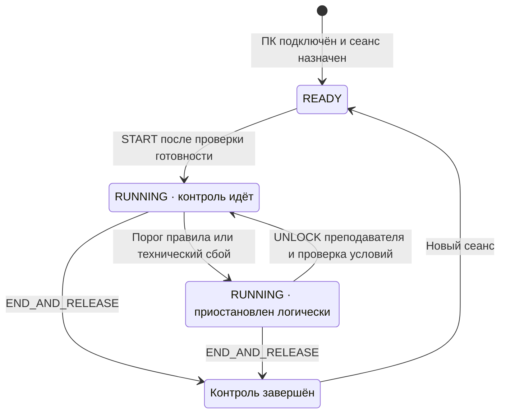
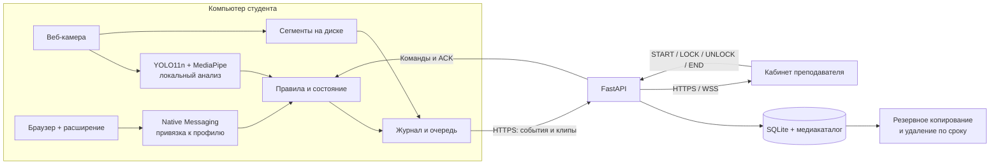

# Qorgau — локальный прокторинг для компьютерной аудитории

Преподаватель управляет сеансом через сайт, а приложение на ПК студента анализирует камеру локально и передаёт события с короткими видеофрагментами. Сам экзамен проходит в выбранном браузере или установленном приложении. Обычный установщик и переносимый EXE автоматически подключаются к нашему серверу: студент ничего не вводит.

**Версия 0.4.1 · правила 3.0 · Windows x64 · наблюдение и ограничение окна.**

[Открыть кабинет](https://212.19.134.23/) · [Проверки и ограничения](docs/VERIFICATION.md) · [Самостоятельная проверка](docs/RELEASE_CHECKLIST.md) · [Презентация на 5 минут](deliverables/Qorgau-pitch-5min-v7.pptx)

> В режиме **GUARDED** агент ограничивает выбранное окно, горячие клавиши и доступ к другим сайтам во встроенном браузере. На экране блокировки преподаватель может разрешить продолжение или завершить контроль своим паролем. Это ограничения процесса Windows: защита от администратора и системного экрана Ctrl+Alt+Del не заявляется. STRICT остаётся выключенным. [Границы защиты](docs/SECURITY.md) · [Критерии на 100 баллов](docs/SCORECARD.md).

Выпуск объединяет ветку `0422e50` и локальную `ad15087`: Windows Guard, Qorgau Browser, проверку пароля и установщик; подготовленный EXE, устойчивую запись всего события, восстановление и серверную эксплуатацию. Телефон — готовый YOLO11n/COCO в ONNX. Экспериментальное обучение друга сохранено в [training](training/README.md); его модели не подменяют рабочее распознавание без независимой оценки.

## Навигация

- [Как выглядит система](#как-выглядит-система)
- [Запуск для преподавателя и студента](#запуск-для-преподавателя-и-студента)
- [Проверка на одном компьютере](#проверка-на-одном-компьютере)
- [Правила и состояния](#правила-и-состояния)
- [Архитектура и данные](#архитектура-и-данные)
- [Установка из исходников](#установка-из-исходников)
- [Сборка полного EXE](#сборка-полного-exe)
- [Ошибки и восстановление](#ошибки-и-восстановление)
- [Места для настоящих фото](#места-для-настоящих-фото)
- [Что проверено](#что-проверено)
- [Документация проекта](#документация-проекта)

## Как выглядит система

Это снимки **работающего кабинета**, сделанные 6 октября 2026 года. Участник, события и цветная видеозапись — **синтетический тренировочный пример**. Они показывают интерфейс, а не точность камеры или защиту Windows.

### Аудитория

Статус каждого компьютера, три независимых счётчика и события для разбора собраны на одном экране. Нажмите изображение, чтобы открыть его полностью.

[](docs/images/dashboard-demo.png)

### Приостановка по правилу

Карточка показывает причину, текущий цикл и действия преподавателя. На примере телефон вызывает логический `LOCKED`. Кнопка «Разрешить продолжить» относится к состоянию контроля; изображение не доказывает блокировку клавиш или программ ОС.

[](docs/images/lock-demo.png)

### Разбор записи с пропуском

У события есть видео, начало эпизода, момент срабатывания и история решения. Неполная запись явно помечается: на этом примере отсутствует интервал 1,0–1,6 с. Цветные полосы — технический тест плеера.

[](docs/images/event-demo.png)

### Экран преподавателя в GUARDED

Реальный интерфейс 0.4.0 с синтетическими событиями автотеста. Пароль позволяет продолжить или завершить контроль на этом же ПК. Этот снимок показывает интерфейс, а не результат физической проверки камеры или защиты.

[](docs/images/lock-screen-0.4.0.png)

## Запуск для преподавателя и студента

Первый запуск 0.4.1: приложение само регистрирует компьютер, полей подключения нет. Ниже снимок интерфейса с условным именем ПК; живое подключение проверяется отдельно.

[](docs/images/auto-connect-0.4.1.png)

### 1. Преподаватель открывает список компьютеров

1. Откройте [кабинет Qorgau](https://212.19.134.23/) и войдите. Доступ описан в [SERVER.md](docs/SERVER.md); пароля в репозитории нет.
2. Перейдите в **«Компьютеры»**. Студенты устанавливают Qorgau из [релиза 0.4.1](https://github.com/ovverage/hackaton-kru/releases/tag/v0.4.1) или открывают [обычный EXE с сервера](https://212.19.134.23/api/student/download).
3. После первого запуска ПК автоматически появляются в списке **«Новые компьютеры»**. Коды подключения, адрес сервера и подготовка отдельного пакета не требуются.
4. Создайте сеанс, выберите появившиеся ПК и среду теста, назначьте имена участников.

Для отдельного ПК есть отзыв доступа с причиной. Дополнительные пакеты аудитории сохранены для настройки других кабинетов и ограниченных ссылок; для обычной установки на нашем сервере они не нужны.

### 2. Студент скачивает и открывает EXE

1. Установите **Qorgau Student 0.4.1** или откройте **Qorgau-Student.exe** на Windows x64. Устанавливать Python, модели или FFmpeg отдельно не требуется.
2. Приложение само подключится к `https://212.19.134.23` и покажет состояние ПК. Имя определяется автоматически, сервер выдаёт отдельный токен. Полей адреса и кода нет. При отсутствии сети подключение повторяется.
3. После назначения сеанса откройте значок Qorgau в трее и нажмите **«Подготовить камеру»**. Камера включается после этого действия. Пройдите подсказки калибровки восьми позиций.
4. Дождитесь команды преподавателя. Перед стартом проверяются камера, свежий кадр, одно лицо, отсутствие телефона и место для записи. Выбранная среда теста открывается автоматически.
5. При приостановке дождитесь решения преподавателя. После завершения убедитесь, что ответы отправлены **в самой системе тестирования**.

**«Скачал и открыл» относится к подключению.** Первичную калибровку камеры студент проходит сам. Qorgau пока не устанавливает службу или автозапуск: после перезагрузки Windows файл нужно открыть снова.

Закрытие окна состояния скрывает его в трей и не завершает агент. Одинаковый каталог данных защищён от второго GUI-экземпляра. Повторный запуск не расходует место пакета и не создаёт дубль ПК. Другой пользователь Windows имеет отдельный профиль и регистрируется отдельно.

Профиль подготовленного EXE хранится в `~/.qorgau/accounts/<идентификатор сервера и кабинета>`. В нём находятся токен, состояние и очередь. Не копируйте эту папку на другие ПК и не публикуйте её. Новый пакет того же кабинета использует уже сохранённую регистрацию.

### Дополнительные подключения и расширение

`dist/Qorgau-Student.exe` и приложение из установщика используют один автоматический сценарий. Адрес по умолчанию задан в `shared/bootstrap.py`, кабинет назначения — только на сервере в `PROCTOR_PUBLIC_ENROLLMENT_OWNER`. В публичной сборке нет пароля преподавателя или общего регистрационного токена. Административный CLI `--enroll` сохранён для старых развёртываний и не появляется в интерфейсе ученика.

Расширение Chrome/Edge сообщает активный сайт и потерю фокуса через Native Messaging. Его установка — отдельный административный шаг; оно само не запрещает переходы и смену вкладок. Точная инструкция привязки к профилю: [SECURITY.md](docs/SECURITY.md).

## Проверка на одном компьютере

Для самостоятельного прогона жюри достаточно согласованного стенда: **Windows 11 Pro x64 и веб-камера**. Кабинет и агент работают на одном ПК. В GUARDED используйте кнопку «Преподаватель» во встроенном браузере или Ctrl+Alt+Q: пароль разрешает продолжение или завершение. Отдельный телефон не требуется.

| Шаг | Действие | Ожидаемый результат |
| --- | --- | --- |
| 1 | Подготовить EXE и запустить его | Новый ПК виден в кабинете без ручного кода |
| 2 | Перезапустить EXE | Тот же ПК, прежняя регистрация, без дубля |
| 3 | Назначить сеанс и подготовить камеру | Предпросмотр и калибровка; готовность к старту |
| 4 | Начать контроль | Открывается выбранный тест, статус RUNNING |
| 5 | Показать телефон в кадре | При выполнении порога — событие и LOCKED |
| 6 | Открыть карточку события | Доступны клип, время и объяснение; пропуски помечены |
| 7 | Убрать телефон, принять решение и разрешить продолжение | Решение сохранено; новый цикл, счётчики обнулены |
| 8 | Завершить контроль | COMPLETED, сохранён отчёт, CSV доступен |

Это **ожидаемые результаты для физической приёмки**, а не запись уже выполненного камерного прогона. Полный список, включая потерю сети, отказ камеры и перезапуск, — в [RELEASE_CHECKLIST.md](docs/RELEASE_CHECKLIST.md).

Для проверки только интерфейса есть отдельный **тренировочный стенд** с виртуальными учениками. Все его события помечены как тренировочные; камера и блокировка ОС не используются.

## Ограничение Windows и проверка на одном ПК

1. Откройте кабинет, подготовьте EXE для аудитории, скачайте и запустите его.
2. Подготовьте камеру: восемь позиций калибровки. Дождитесь готовности и появления Qorgau Browser в списке сред.
3. В кабинете создайте сеанс, выберите **Qorgau Browser**, HTTPS-адрес теста и **Ограничение Windows**. Запустите контроль.
4. Проверьте чтение, три отдельных отвлечения по 5 секунд, телефон. Между критическими событиями преподаватель разрешает продолжение.
5. На блокировке уберите телефон, вернитесь в кадр, введите пароль кабинета. При неисправной камере доступна кнопка восстановления; восстановление камеры само не разблокирует тест.
6. Чтобы вызвать преподавателя без нарушения, нажмите **«Преподаватель»** в Qorgau Browser либо **Ctrl+Alt+Q**. Пароль позволяет завершить контроль на этом же ПК, даже при неисправной камере.
7. После завершения вернитесь в кабинет и разберите клипы, решения, журнал и CSV. Внешний тест отправляется его собственной кнопкой: Qorgau не отправляет ответы автоматически.

Сайт с входом через другой домен, внешними iframe или обязательным новым окном требует отдельной проверки совместимости. Начните с одно-доменной тестовой страницы. Открытое приложение выбирается через «Выбрать главное окно / приложение» до назначения сеанса. Браузер общего назначения нельзя выдать за защищённое приложение.

## Правила и состояния

| Наблюдение | Порог правил 3.0 | Действие |
| --- | --- | --- |
| Взгляд вниз, влево или вправо | Непрерывный эпизод от 5 с; отдельный счётчик для каждого направления | +1 к соответствующему счётчику; третий эпизод в одном направлении → LOCKED |
| Неуверенное направление | UNKNOWN | Прерывает таймер эпизода, не прибавляет балл |
| Телефон | Два обнаружения с уверенностью ≥0,65 за ≤0,6 с | Немедленный LOCKED по правилу телефона |
| Второе лицо | Не менее 1 с | Событие для ручной проверки |
| Лицо отсутствует | От 3 с / от 10 с | Ручная проверка / техническая приостановка |
| Частые короткие отвлечения | Отдельная временная эвристика | Событие для ручной проверки |
| Подъём телефона к экрану | Движение и удержание по эвристике | Событие для разбора; не доказывает фотографирование |
| Отказ камеры или записи; перезапуск во время сеанса | Технический сбой | Приостановка с явной причиной и восстановлением через преподавателя |

Калибровка использует признаки глаз и головы, а не измерение точного угла взгляда. Автоматическое событие — повод посмотреть запись. **Окончательное решение принимает преподаватель**, указывая причину; автоматического вывода о списывании нет.



Отклонение события корректирует его вклад в счётчик, но **не разблокирует автоматически**. При разрешении продолжения начинается новый цикл; история остаётся. Команды содержат версию состояния, а разблокировка — идентификатор блокировки: устаревшее действие не должно менять новый сеанс.

## Архитектура и данные


<details>
<summary>Та же схема в редактируемом формате Mermaid</summary>



</details>

- **Камера:** запрашиваются 720p и 15 кадров/с; фактические параметры зависят от устройства. Анализ выполняется локально, звук не записывается. Сервер не получает непрерывный видеопоток.
- **Запись события:** весь доступный интервал эпизода + до 10 с до его начала и 5 с после окончания. Длинные записи разбиваются на соседние MP4-части до 30 с. Недостающие интервалы отображаются в кабинете.
- **Потеря сети:** события и клипы остаются в очереди на диске. После восстановления они отправляются повторно с защитой от дублей; клип удаляется локально после подтверждения сервера.
- **Ресурсы диска:** для старта нужно минимум 1 ГБ свободного места; лимит локального буфера — 2 ГБ, резерв — 512 МиБ. Активные доказательства не вытесняются молча; невозможность записи становится техническим сбоем.
- **Срок:** сервер удаляет видео завершённых сеансов через 7 дней. Преподаватель может продлить конкретную запись с причиной. Удаление фиксируется в аудите; запись события остаётся. Локальные неотправленные клипы завершённого сеанса также ограничены сроком, очистка выполняется при работе/следующем запуске агента.
- **Копии:** сервер хранит последние 7 успешных резервных архивов. Их ротация отдельная; при сбоях копирования старые архивы могут сохраняться дольше. Подробнее — [SECURITY.md](docs/SECURITY.md).
- **Доступ:** отдельный токен каждого ПК, Argon2 для паролей, HttpOnly-сессии, проверка владельца события и клипа. Видео доступно после авторизации, поддерживает HTTP Range.

На текущем сервере свободно около **0,8 ГБ**. Этого достаточно для ограниченного демонстрационного стенда, но вместимость архива аудитории из 50 камер не подтверждена. Развёртывание, резервные копии, сертификат по IP и откат описаны в [SERVER.md](docs/SERVER.md).

## Установка из исходников

Проверенное окружение сборки студенческого приложения: **Windows x64, Python 3.12.14**. Для веб-панели используется Node.js и npm; файл `web/package-lock.json` фиксирует зависимости. Чистый целевой ПК для EXE отдельно проходит ручную приёмку.

В PowerShell из корня проекта:

```powershell
py -3.12 -m venv .venv
.venv\Scripts\python.exe -m pip install -r requirements-core.lock
.venv\Scripts\python.exe -m pip install -r requirements-student.lock
.venv\Scripts\python.exe -m pip install --no-deps -e .
.venv\Scripts\python.exe -m pip install "pytest>=8,<10"
npm --prefix web ci
npm run dev
```

Откройте адрес Vite из терминала (обычно `http://localhost:5173`). API запускается на `http://127.0.0.1:8000`. При первом локальном запуске создайте учётную запись преподавателя. Не публикуйте незавершённую первоначальную настройку в интернете.

В отдельном терминале агент из исходников запускается так:

```powershell
.venv\Scripts\python.exe -m agent.client
```

Для камеры предварительно подготовьте модели по следующему разделу. GUI также можно открыть через `Start-Student.cmd`. Не устанавливайте одновременно разные варианты OpenCV в одно окружение: здесь используется `opencv-contrib-python` из lock-файла.

### Проверки и разработка

```powershell
.venv\Scripts\python.exe -m pytest -q -rs
npm run build
.venv\Scripts\python.exe scripts/stress_scenarios.py
.venv\Scripts\python.exe scripts/load_test.py --seconds 7200 --clients 50 --output .local/evidence/load-50-2h.json
```

Нагрузочные сценарии поднимают **изолированный локальный сервер** с временной БД. Они не направляют нагрузку на публичный сервер. Смешанный сценарий включает видео, а двухчасовой — heartbeat/команды/снимки; ни один не заменяет испытание 50 настоящих камер.

```text
agent/             Windows-агент, CV, камера, запись, профиль, SEB-адаптер
backend/proctor/   API, авторизация, БД, пакеты EXE и сроки хранения
shared/            Общие правила, состояния, bootstrap и атомарное хранение
web/src/           Кабинет преподавателя на React + TypeScript
extension/         Chrome/Edge Manifest V3 и Native Messaging
scripts/           Сборка, модели, нагрузка, replay и оценка
models/            Локальные веса моделей; не входят в Git
deploy/            systemd, резервные копии и административные сценарии
docs/              ТЗ, приёмка, безопасность, сервер, метрики и фото
deliverables/      Презентация для защиты
.local/            Частные отчёты и данные проверки; не входят в Git
dist/              EXE, ZIP и release-manifest.json; не входят в Git
```

## Сборка полного EXE

Сборка выполняется на Windows x64. Среда экспорта моделей отделена от среды приложения: Torch и Ultralytics не включаются в студенческий EXE.

```powershell
# Один раз: инструменты подготовки моделей
py -3.12 -m venv .local/model-build
.local/model-build/Scripts/python.exe -m pip install torch==2.6.0 torchvision==0.21.0 --index-url https://download.pytorch.org/whl/cpu
.local/model-build/Scripts/python.exe -m pip install ultralytics==8.3.221 onnx==1.17.0 onnxruntime==1.24.3
.local/model-build/Scripts/python.exe scripts/prepare_models.py

# Комплектные notices и полная сборка
.venv/Scripts/python.exe scripts/prepare_licenses.py
.venv/Scripts/python.exe scripts/build_student.py --with-cv
.\dist\Qorgau-Student.exe --self-test .local/evidence/exe-selftest.json
.venv/Scripts/python.exe scripts/smoke_student_exe.py
.venv/Scripts/python.exe scripts/package_release.py
```

`prepare_models.py` получает официальные предварительно обученные модели, проверяет известные SHA-256 и экспортирует YOLO11n в ONNX. Это **не собственное обучение**. Источники, версии и хеши находятся в [model-manifest.json](model-manifest.json). Повторный экспорт может изменить хеш выходного ONNX; обновление манифеста нужно просмотреть вместе с результатом self-test.

| Артефакт в `dist/` | Назначение |
| --- | --- |
| `Qorgau-Student.exe` | Базовый EXE с моделями, ONNX Runtime, MediaPipe, FFmpeg и NativeHost |
| `Qorgau-NativeHost.exe` | Native Messaging host для административной установки |
| `Qorgau-SecurityBridge.exe` | Экспериментальный мост SEB, не принятый строгий режим |
| `Qorgau-Source-0.4.0.zip` | Исходники и документация по явному списку, без `.local`, токенов и записей |
| `Qorgau-Admin-0.4.0.zip` | Административные материалы, расширение, исходники и notices |
| `release-manifest.json` | Размеры, SHA-256 и сведения о выпуске |

Размер и SHA-256 базового EXE 0.4.0 указаны в `dist/release-manifest.json`; браузер QtWebEngine включён в пакет. Подготовленный сервером файл аудитории имеет иной хеш из-за встроенных параметров регистрации. Для распространения студентам используйте кнопку **«EXE для аудитории»**.

Инструменты сбора разметки, независимого разделения участников, обучения, replay и расчёта precision/recall подготовлены. Команды и требования к данным: [CV_EVALUATION.md](docs/CV_EVALUATION.md). Реальные размеченные записи пока не предоставлены; проценты точности не заявляются.

## Ошибки и восстановление

| Что видно | Что это означает | Что делать |
| --- | --- | --- |
| ПК не появился после запуска | Нет сети, сервер недоступен или пакет недействителен | Проверить HTTPS-адрес и срок пакета; сетевые ошибки первого подключения повторяются каждые 10 с |
| Пакет истёк / отозван / исчерпан | Новая регистрация запрещена параметрами пакета | Преподаватель создаёт новый пакет или увеличивает подходящий лимит через новый пакет; не копировать чужой профиль |
| Доступ устройства отозван | Токен данного ПК больше не действует | Проверить причину в кабинете; администратор готовит новое разрешённое подключение |
| Камера не готова | Нет разрешения Windows, камера занята, модели недоступны или калибровка не завершена | Закрыть другое приложение камеры, проверить доступ и пройти «Подготовить камеру» |
| «Не удалось получить или сохранить видео камеры» | Сбой захвата, кодирования или свободного места | Проверить камеру и диск; восстановить подготовку при технической приостановке; продолжение разрешает преподаватель |
| Лицо не было видно 10 секунд | Техническая причина `FACE_ABSENCE_TECHNICAL` | Вернуться в кадр, проверить освещение и дождаться преподавателя |
| «Дождитесь решения преподавателя» | Активен LOCKED с указанной причиной | Преподаватель разбирает событие; студент не снимает состояние перезапуском |
| Перезапуск во время контроля | Причина `AGENT_RESTARTED` | Подготовить камеру заново; восстановленные события и клипы отправятся из очереди |
| Запись неполная | В нужном интервале есть пропуски | Посмотреть их границы; не интерпретировать отсутствие кадра как доказательство нарушения |
| Ошибка 507 при отправке клипа | На сервере недостаточно свободного места | Администратор проверяет хранилище; агент сохраняет очередь для повтора |
| Native Messaging: чужой / устаревший профиль | Не совпадают каталог, UUID браузера или активная lease | Повторить точную привязку по [SECURITY.md](docs/SECURITY.md); не подменять токены вручную |
| Предупреждение Windows об издателе | Релиз пока не подписан сертификатом издателя | Администратору проверить источник и SHA-256; проверка SmartScreen на чистом ПК остаётся частью приёмки |

Состояние контроля, решения и сообщения о технических проблемах сохраняются в журнале. Не удаляйте профиль ради «починки» во время активного сеанса: это затруднит восстановление и разбор.

## Места для настоящих фото

Ниже зарезервирована галерея реального прогона. Сейчас эти кадры **ещё не сняты**. Скриншоты кабинета выше не заменяют их. Для публикации используйте тестового участника с согласием; токены, имена реальных учащихся и посторонние окна не должны попадать в репозиторий.

Список файлов и подписи: [manifest.json](docs/images/photos/manifest.json). Как снять и добавить кадры: [инструкция](docs/images/photos/README.md). После добавления разрешённых изображений выполните:

```powershell
.venv/Scripts/python.exe scripts/update_readme_gallery.py
```

<!-- REAL_PHOTOS_START -->
### Подключение реального ПК

Показать окно агента после запуска подготовленного EXE и соответствующий компьютер в кабинете. Скрыть идентификаторы и адреса профиля, если они раскрывают доступ.

> Ожидается реальный прогон. Файл: `docs/images/photos/student-start.png`.

### Калибровка камеры

Кадр прохождения калибровки на Windows 11 Pro с добровольным тестовым участником. В подписи к готовому фото указать модель камеры и условия освещения.

> Ожидается реальный прогон. Файл: `docs/images/photos/camera-calibration.png`.

### Телефон и приостановка контроля

Реальный телефон в кадре, причина PHONE_DETECTED и событие в кабинете. Отдельно записать задержку и результат разбора; логический LOCKED не является доказательством защиты ОС.

> Ожидается реальный прогон. Файл: `docs/images/photos/phone-lock.png`.

### Третий эпизод отвлечения

Счётчик одного направления 3/3 и соответствующая причина приостановки после трёх отдельных эпизодов от пяти секунд. Использовать реальное наблюдение камеры.

> Ожидается реальный прогон. Файл: `docs/images/photos/gaze-lock.png`.

### Ошибка камеры или записи

Техническое сообщение после контролируемого отказа камеры или записи. В протоколе указать способ воспроизведения, код причины и успешное восстановление через преподавателя.

> Ожидается реальный прогон. Файл: `docs/images/photos/camera-error.png`.

### Разбор настоящего события

Клип реального прогона, отметка времени и мотивированное решение преподавателя. Для публичного README использовать только разрешённый обезличенный кадр.

> Ожидается реальный прогон. Файл: `docs/images/photos/teacher-review.png`.

### Проверка защиты Windows — после приёмки

Добавлять только после реального испытания защищённой среды. Фото дополняется протоколом попыток обхода и аварийного выхода; само изображение экрана не доказывает защиту.

> Ожидается реальный прогон. Файл: `docs/images/photos/windows-protection.png`.
<!-- REAL_PHOTOS_END -->

## Что проверено

Автоматические тесты обновлены для 0.4.0. Длительный HTTP-прогон ниже относится к 0.3.0; свежая смешанная нагрузка и сборка фиксируются отдельно. Полные условия и свидетельства — в [VERIFICATION.md](docs/VERIFICATION.md).

| Проверка | Результат |
| --- | --- |
| Смешанная нагрузка 0.4.0 | 50 клиентов, 122,01 с, p95 **214,69 мс**, 50 клипов, 0 ошибок |
| Python | Локально **115 passed, 1 skipped**; на отдельном Windows-runner CI **116 passed**, включая жизненный цикл хуков |
| Установщик 0.4.0 | Установка, восстановление файлов, защита запущенного клиента, самопроверка, удаление с сохранением данных — PASS; [релиз](https://github.com/ovverage/hackaton-kru/releases/tag/v0.4.0) |
| TypeScript и Vite | Сборка успешна |
| Полный EXE | Загрузка обеих моделей, ONNX inference, H.264 encode/decode — PASS |
| Публичный сервер | HTTPS по IP, WSS, доступ к видео, Range 206, CSV и отзыв токенов проверены |
| Автоподключение | Два изолированных профиля на одном физическом ПК; разные токены и отсутствие дубля после перезапуска |
| Смешанная нагрузка 0.3.0 (история) | 50 клиентов, 121,9 с, 3074 обычных запроса, p95 **332,29 мс**, 0 ошибок; 50 синтетических клипов общим объёмом 318,9 МБ, 12 WSS reconnect, 50 повторов команд |
| Двухчасовой прогон 0.3.0 (история) | PASS: 50 клиентов, 7202.35 с, 181293 запросов, 13 ошибок (0.0072%), p95 195.60 мс по последним 100 000 запросам. Heartbeat каждые 2 с, команды и снимки; без камер и видео. Это частичная проверка R08. |
| Реальная камера / чистая Windows / защита ОС | Ожидают физической приёмки |
| Точность CV / обучение / пилот | Эксперименты друга сохранены; рабочая CV-точность и пилот пока не приняты |

Смешанный тест шёл на локальном Windows-хосте с 16 логическими CPU, с двумя параллельными загрузками 720p/30-секундных синтетических клипов. Во время измерений на том же ПК выполнялись другие проверки и сборка; машина не была выделена только под бенчмарк. Эти числа не характеризуют сервер под 50 живыми камерами. Задача довести проект до максимальной оценки описана в ТЗ; **оценку 100/100 эти проверки не гарантируют**.

## Документация проекта

| Документ | Что внутри |
| --- | --- |
| [ТЗ v3](docs/TZ_Qorgau_v3.md) | Требования, задачи, приоритеты и критерии приёмки |
| [Сервер](docs/SERVER.md) | IP/HTTPS, служба, обновление, копирование, сроки и откат |
| [Проверки](docs/VERIFICATION.md) и [JSON-свидетельства](docs/evidence/README.md) | Выполненные испытания, числа и открытые ограничения |
| [Безопасность](docs/SECURITY.md) | Границы наблюдения, данные, Native Messaging и SEB |
| [CV и обучение](docs/CV_EVALUATION.md) | Модели, разметка, split участников, replay, обучение и метрики |
| [Приёмка](docs/RELEASE_CHECKLIST.md) | Самостоятельный прогон на одном ПК и условия выпуска |
| [Пилот и эффект](docs/PILOT.md) | Протокол пилота и расчёты с явными предположениями |
| [Защита проекта](docs/DEMO.md) | Пятиминутный сценарий и ответы на вопросы |
| [Фото](docs/images/photos/README.md) | Подготовленные места для реальных иллюстраций |
| [Сторонние компоненты](THIRD_PARTY_NOTICES.md) | Лицензии моделей, библиотек и фактической сборки FFmpeg |

Веса YOLO11n связаны с AGPL-3.0; MediaPipe — Apache-2.0; включённая сборка FFmpeg имеет GPL-компоненты. Комплект notices формируется вместе с EXE. Лицензия собственного кода проекта пока отдельно не выбрана; наличие исходников не означает автоматического разрешения любого способа распространения.
