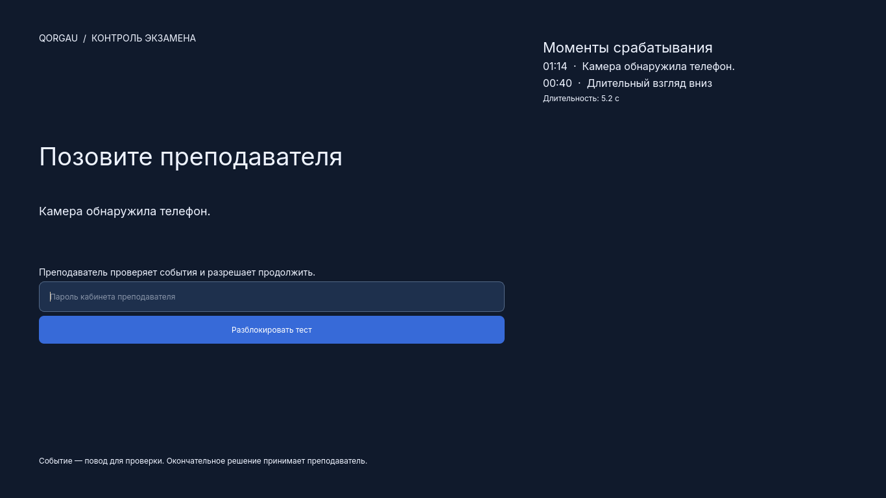
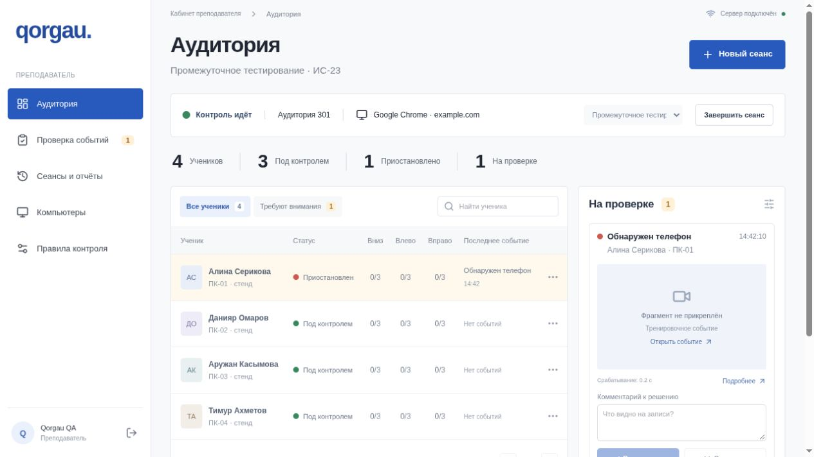

# Qorgau · экзамен в своей системе, контроль рядом

Локальный прокторинг для **Qostanai Industry Hackathon 2026**, кейс №3 КРУ и Qostanai Hub. Windows-агент контролирует выбранное окно теста, анализирует камеру и приостанавливает доступ при срабатывании правил. Преподаватель видит аудиторию, проверяет события с видео и принимает решение.

**Версия 0.3.1 — проверяемый хакатонный прототип.** Это ограничение пользовательской сессии Windows, а не защита от администратора ОС. Реальные метрики обучения, ограничения и план внедрения приведены ниже.

[Скачать установщик .exe](https://github.com/ovverage/hackaton-kru/releases/download/v0.3.1/Qorgau-Student-Setup-0.3.1-x64.exe) · [Все файлы релиза](https://github.com/ovverage/hackaton-kru/releases/tag/v0.3.1) · [Установка и удаление](docs/INSTALL.md) · [Демонстрация и питч](docs/DEMO.md) · [Угрозы и решения](docs/SECURITY.md) · [Обучение и датасет](training/README.md)

## Задача и решение

Во время теста преподавателю трудно одновременно следить за окнами, телефоном, направлением взгляда и несколькими десятками студентов. Qorgau собирает эти сигналы в одном сеансе и показывает проверяемые моменты срабатывания. Сам тест остаётся в действующей системе учебного заведения; перенос вопросов и ответов не требуется.

1. Преподаватель подключает компьютеры одноразовым кодом и назначает тест.
2. В приложении ученика выбирают главное открытое окно или установленное приложение. Для сайта доступен Qorgau Browser с одним разрешённым origin и без вкладок.
3. Ученик проходит калибровку камеры по восьми позициям: центр и края экрана, затем вниз, влево и вправо за его пределы.
4. В режиме ограничения Windows работают только выбранное окно и экран преподавательской разблокировки. Запрещённые сочетания клавиш и взаимодействие с другими окнами перехватываются.
5. При блокировке появляется **«Позовите преподавателя»**. Справа — причины, время срабатываний, длительность и доступные миниатюры. В кабинете доступны видеофрагменты.
6. Преподаватель вводит пароль своего кабинета на этом ПК либо отправляет команду из панели. Разблокировка начинает новый цикл счётчиков; история остаётся.





## Что реализовано

| Подсистема | Поведение |
|---|---|
| Камера | Локальные YOLO11n COCO для телефона и MediaPipe Face Landmarker для лиц/признаков глаз и головы; обработка до 10 кадров/с |
| Взгляд | Персональная калибровка, восемь позиций, отдельные DOWN / LEFT / RIGHT, временные пороги и гистерезис |
| Windows | Выбор HWND или .exe, проверка PID/времени запуска/пути, keyboard/mouse hooks, контроль фокуса, покрытие всех экранов |
| Браузер | Один view без вкладок; запрет внешней навигации, popup, скачиваний и контекстного меню; одноразовый профиль без старых cookies |
| Блокировка | Полноэкранное объяснение, сохраняемая лента событий, пароль на сервере, защита от перебора и старых команд |
| Кабинет | Таблица аудитории, WebSocket, фильтр внимания, видео, история решений и CSV |
| Запись | До 10 секунд перед событием и 5 после, H.264/MP4 без звука, локальная очередь повторной доставки |
| Сбои | Журнал на диске; перезапуск активного агента сохраняет блокировку; в GUARDED потеря сети более 10 с останавливает доступ |
| ML-пакет | SHA-256, проверка разделений, воспроизводимые эксперименты на открытых и собственных данных, модели и отчёты |
| Поставка | Установщик .exe и portable ZIP для Windows x64; CI проверяет установку, ярлыки, повторную установку, инференс и удаление |

Телефон в кадре не устанавливает намерение фотографировать монитор. Второе лицо, отсутствие лица и спорные движения требуют проверки человеком. Qorgau не выставляет оценку и не выносит окончательный вердикт о списывании.

## Правила срабатывания

| Сигнал | Условие | Реакция |
|---|---|---|
| DOWN / LEFT / RIGHT | Один эпизод не менее 5 секунд | Один балл в соответствующем направлении |
| Третий длительный эпизод | Три балла **в одном** направлении | LOCKED |
| Телефон | Два обнаружения с уверенностью ≥0,65 в интервале ≤0,6 с | LOCKED без ожидания трёх баллов |
| Второе лицо | Не менее 1 секунды | REVIEW |
| Лицо отсутствует | Не менее 5 секунд | REVIEW |
| Частые короткие отвлечения | Накопление по модулю правил | REVIEW |
| Камера / кодирование недоступны | Ошибка во время контроля | LOCKED |
| Нет связи с сервером | Более 10 секунд в GUARDED | LOCKED |
| Закрыто окно, RDP, изменилось число экранов | Обнаружено в GUARDED | LOCKED |

Возврат взгляда, исчезновение телефона, восстановление сети и перезапуск не снимают блокировку. Разблокировка проверяет `exam_id`, `lock_id` и версию состояния. Если телефон ещё обнаруживается, камера неисправна или защита окна не готова, команда не применяется. Преподаватель может завершить сеанс отдельно.

## Готовый Windows-клиент

1. Скачать **`Qorgau-Student-Setup-0.3.1-x64.exe`** из релиза и пройти мастер установки. Ничего распаковывать вручную не нужно.
2. Запустить **Qorgau Student** из меню «Пуск». Python, модели, Qt и кодировщик входят в сборку; установка выполняется для текущего пользователя без запроса прав администратора.
3. Ввести адрес сервера, название компьютера и одноразовый код из кабинета преподавателя. Код действует пять минут и используется один раз.
4. До назначения сеанса нажать **«Выбрать главное окно / приложение»**, если тест проходит в установленном приложении. Для веб-теста преподаватель выбирает **Qorgau Browser**.
5. Нажать **«Подготовить камеру»**, пройти восемь позиций. В полной сборке пути к моделям заполнены автоматически.
6. В кабинете выбрать ПК, среду и **«Ограничение Windows»**. Начать контроль.

Пароль разблокировки — пароль кабинета преподавателя, которому принадлежит устройство. Он не сохраняется в агенте. После пяти неверных попыток действует минутная задержка. Для проверки необходима связь с сервером.

Альтернатива без установки — `Qorgau-Student-Windows-x64.zip`: распаковать **всю папку** и запустить `Qorgau-Student.exe`, сохранив `_internal` рядом. Не скачивайте `Source code.zip`, если нужен готовый клиент. Установщик пока **не подписан цифровым сертификатом**; сверяйте SHA-256 из релиза, не отключайте системную защиту. Подробнее — [INSTALL.md](docs/INSTALL.md).

Обычные Chrome/Edge доступны в режиме наблюдения с необязательным расширением из `extension/`. Для защищённого веб-теста используется Qorgau Browser. Сайты с внешним SSO, сторонними iframe, popup или загрузкой файлов требуют адаптации политики и отдельной проверки. Выбор установленного приложения предполагает доверие к его внутренним функциям.

При завершении контроль и перехват ввода выключаются; окно теста остаётся открытым для проверки отправки ответов. Задания и ответы Qorgau не отправляет за студента.

## Быстрый запуск из исходников

Сервер: Python 3.12, Node.js 22.12+. Камера необязательна для демонстрационного стенда. Команды выполняются из корня репозитория.

### Windows PowerShell

```powershell
py -3.12 -m venv .venv
.venv\Scripts\python.exe -m pip install -r requirements-core.lock
.venv\Scripts\python.exe -m pip install -e ".[test,desktop]"
npm --prefix web ci
npm run build
.venv\Scripts\python.exe -m uvicorn backend.proctor.app:app --host 127.0.0.1 --port 8000
```

### Linux / macOS — сервер, обучение, наблюдение

```sh
python3.12 -m venv .venv
.venv/bin/python -m pip install -r requirements-core.lock
.venv/bin/python -m pip install -e '.[test,desktop]'
npm --prefix web ci
npm run build
.venv/bin/python -m uvicorn backend.proctor.app:app --host 127.0.0.1 --port 8000
```

Открыть **http://127.0.0.1:8000** и создать кабинет. Пароля по умолчанию нет. Сервер сохраняет данные в `.local/`; путь меняется через `PROCTOR_DATA`. Для разработки — `npm run dev`, панель на порту 5173. Агент — `npm run student` или `Start-Student.cmd` на Windows.

Для CV дополнительно установить CPU-версии PyTorch/torchvision, затем зависимости и официальные модели:

```sh
python -m pip install torch torchvision --index-url https://download.pytorch.org/whl/cpu
python -m pip install -e '.[cv]'
python scripts/fetch_models.py
```

Здесь `python` означает интерпретатор созданной `.venv`. Модели не загружаются при старте экзамена. `models/manifest.json` содержит источники и SHA-256; загрузчик проверяет закреплённые хеши.

Для LAN нужны TLS, `PROCTOR_SECURE_COOKIE=1` и `PROCTOR_ALLOWED_ORIGINS=https://ваш-домен`. Агент допускает HTTP только для loopback. Первый кабинет создайте локально до открытия сервера в сеть. [Настройка аудитории и границы защиты →](docs/SECURITY.md)

## Датасет и обучение: работа команды

**Мы проводили эксперименты по обучению не только на готовом открытом датасете, но и собрали собственный набор данных для Qorgau.** Это два направления: дообучение детектора поведения на открытых данных и обучение бинарного классификатора взгляда на собственных размеченных кадрах. Они не подменяют готовую COCO-модель телефона в рабочем агенте.

| Источник | Состав и использование |
|---|---|
| Собственная съёмка | **496 фото + 132 видео = 628 файлов**. Два участника; общая коллекция присутствия человека имеет неизвестную принадлежность участникам |
| Собственная разметка взгляда | 123 видео, 1 392 просмотренных ключевых кадра; 1 063 кадра из 110 видео подготовлены для экспериментального обучения. Калибровка и контроль исключены |
| Открытый набор | [Students' Abnormal Behavior in Online Exam Dataset](https://zenodo.org/records/14606173): 5 575 изображений; 5 493 размеченных, 81 без разметки, 1 в карантине |
| Public split | 3 888 train / 887 val / 718 test; серии записи и точные дубликаты не пересекают разделения |
| Всего в пакете | **6 203 исходных медиафайла**, около 3,25 GB без производных материалов |

Разметка взгляда предварительная: ключевые кадры с контекстом сценариев, без ground truth айтрекера. Метки `mobile_use` открытого набора описывают поведение и **не являются рамками телефона**. Совместное дообучение phone/face требует проверки объектных рамок: неподтверждённые предложения не считаются отрицательными примерами.

Результаты и воспроизведение — в [training/README.md](training/README.md), машинные отчёты — в `training/reports/`. Базовый gaze-классификатор показал слабую переносимость между двумя участниками и не включён в автоматические решения. Это основание для индивидуальной калибровки и дальнейшего сбора данных, а не для заявления высокой точности.

Полный эксперимент поведения: пять эпох на 3 888 train, проверка на 718 test, **mAP50 0,4497**. Это метрика пяти классов поведения, а не показатель точности детекции телефона в рабочем агенте.

Фото, видео, токены, журналы и пользовательские записи исключены из Git. Релиз экспериментов содержит веса и отчёты, а не лица участников. [Происхождение пакета](training/provenance/dataset-summary.json).

## Структура

```text
agent/                 Windows/Qt, выбор окна, блокировка, CV, запись
backend/proctor/       FastAPI, авторизация, команды, SQLite, аудит, видео
shared/                Правила и общие признаки взгляда
web/                   React + TypeScript, кабинет преподавателя
extension/             Наблюдение в обычном Chrome/Edge
training/              Импорт, обучение, разметка, provenance, отчёты
scripts/               Запуск, модели, сборка, QA-стенд
tests/                 Правила, API, агент, GUI, запись, безопасность
docs/                  Демонстрация, угрозы, релиз, исходное ТЗ
.github/workflows/     Linux-проверки и Windows .exe
data/ models/ .local/  Локальные данные; не коммитятся
```

Агент отправляет события и подтверждения серверу; сервер возвращает назначение и команды. Правила одинаковы для реальной камеры и явно обозначенного стенда. Изменение решения преподавателем сохраняется как новая ревизия. Отклонение события не является автоматической разблокировкой.

## Проверка и сборка

```sh
npm test
npm run build
python -m agent.client --self-test runtime-check.json
python scripts/build_student.py --with-cv
python scripts/build_installer.py  # Windows, установлен Inno Setup 6
```

`--self-test` проверяет загрузку локальной страницы и JavaScript в QtWebEngine, YOLO CPU, MediaPipe и H.264 **без включения камеры и перехвата клавиш**. На Windows проверяются перечисление окон Win32 и маркер запущенного приложения для установщика. Сборка выполняется на целевой ОС; `.exe` создаётся Windows-runner GitHub Actions. Push в main проверяет код и веб-панель; тег `v*` или ручной запуск дополнительно собирает Windows-клиент и установщик. Prerelease создаётся по тегу только после успешных проверок, включая цикл установки и удаления.

Автотесты проверяют правила, пароль, stale/replay-команды, поддельное снятие блокировки через heartbeat, сохранение событий, origin-политику, импорт ZIP и клипы. CI и синтетический кадр не заменяют испытания камерой в аудитории. [Чек-лист ручной Windows-приёмки](docs/WINDOWS_ACCEPTANCE.md).

## Соответствие критериям жюри

| Критерий | Баллы | Что показать |
|---|---:|---|
| Соответствие кейсу и понимание задачи | 15 | Телефон, взгляд, лица, выбранное окно и запрет переключений |
| Качество технической реализации | 20 | Общие правила, агент/сервер, проверка команд, тесты, Windows-сборка |
| Потенциал внедрения и эффект | 20 | Подключение без переноса тестов, локальные вычисления, измеримый пилот |
| Инновационность | 15 | Восемь позиций калибровки, свои данные, объяснимые эпизоды и решения преподавателя |
| Работоспособность и демонстрация | 15 | Живое срабатывание, блокировка, пароль, восстановление и журнал |
| Питч и ответы | 15 | Проблема → демо → архитектура → реальные данные → внедрение |
| **Итого** | **100** | [Сценарий и вопросы жюри](docs/DEMO.md) |

## Пилот и ожидаемый эффект

Начать с одной аудитории и теста низкой значимости. Измерить время преподавателя на разбор, ложные блокировки на студент-час, обнаружение постановочных эпизодов, задержку реакции, CPU/RAM и восстановление после сбоев. Сравнить одинаковые сценарии с ручным контролем. Две группы и 20–30 добровольцев дадут более полезную проверку, чем повторение кадров тех же двух людей.

Ожидаемый эффект — меньше ручного поиска подозрительных моментов и единая история при сохранении привычной системы тестирования. Экономия времени и точность в аудитории **пока не измерены**.

Компоненты и модели имеют собственные лицензии: [THIRD_PARTY_NOTICES.md](THIRD_PARTY_NOTICES.md). Для внедрения нужны защищённая Windows-конфигурация, регламент хранения, больше размеченных участников и независимая приёмка.
