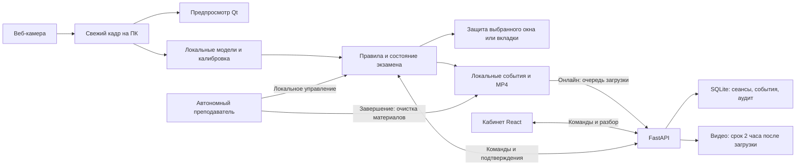
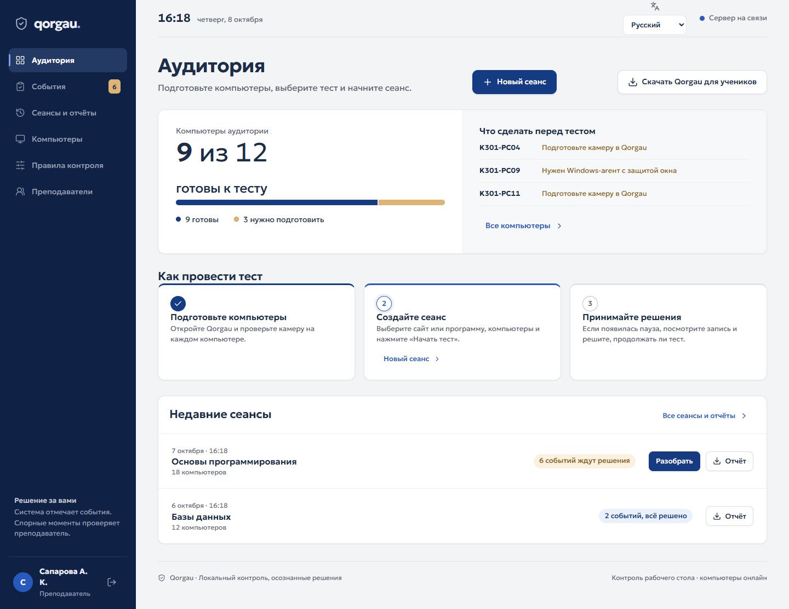
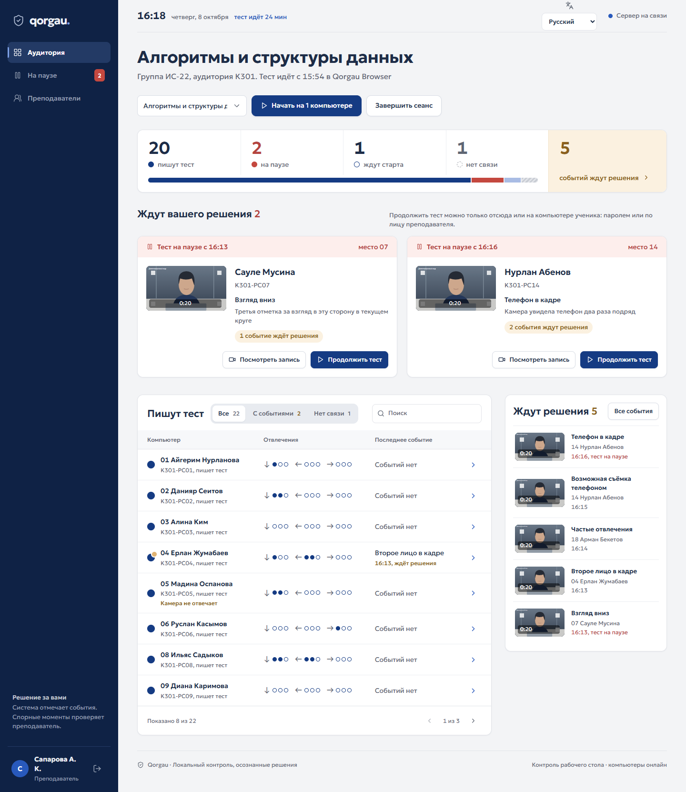
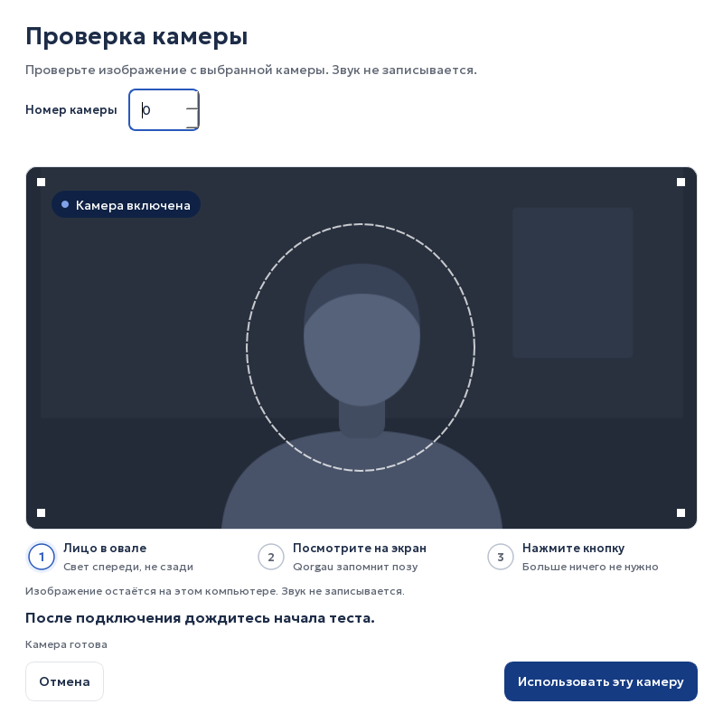
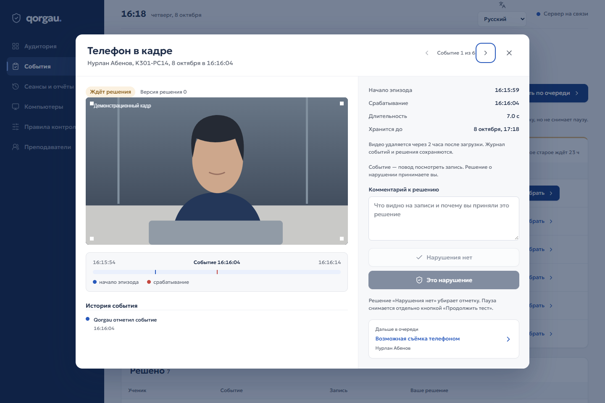

# Qorgau — прокторинг для компьютерной аудитории

Qorgau помогает преподавателю проводить экзамен на компьютерах Windows: приложение анализирует веб-камеру локально, контролирует выбранную среду теста и сохраняет материалы событий для разбора. Поддерживаются сеанс из веб-кабинета и автономный запуск на одном компьютере.

**Версия исходников 0.5.3 · Windows x64 · функциональный MVP для хакатона и контролируемого пилота.** Статус публикации и состав конкретного EXE проверяйте в [выпусках](https://github.com/ovverage/hackaton-kru/releases) и их `SHA256SUMS.txt`: обновление сайта не обновляет ранее скачанное приложение.

[Кабинет преподавателя](https://212.19.134.23/) · [Онлайн-приложение](https://212.19.134.23/api/student/download) · [Автономное приложение](https://212.19.134.23/api/student/download-offline) · [История изменений](docs/RELEASE_NOTES.md) · [Карточка моделей](docs/MODEL_CARD_2026_10_07.md) · [Приёмка](docs/RELEASE_CHECKLIST.md)

## Для какой среды

Qorgau работает поверх выбранной среды тестирования: ему не нужны плагины Moodle или Platonus, чтобы анализировать камеру и защищать окно. Онлайн-сеанс открывает сайт в собственном Qorgau Browser либо контролирует выбранную программу. Автономный сеанс привязывается к программе или конкретной вкладке Chrome/Edge через расширение. Вопросы, ответы, оценки и учётные записи самой системы тестирования остаются в этой системе.

Встроенный браузер разрешает навигацию только внутри одного origin — сочетания протокола, имени сервера и порта. Сторонний SSO, всплывающее окно входа, загрузка файла или переход на другой origin требуют отдельного сценария совместимости и не считаются автоматически поддержанными. До экзамена нужно пройти настоящий вход и тест на выбранной платформе. Выбор вкладки внешнего браузера также требует проверки его профиля и расширения.

MVP предназначен для пилотного внедрения в образовательной организации, в том числе государственной, на её компьютерах и сервере. Это готовая функциональная основа такого пилота, а не аттестованная государственная информационная система: интеграция, регламент данных, условия компонентов, аппаратная приёмка и независимая оценка качества согласуются для конкретной площадки.

## Два режима

| | Онлайн | Автономный |
| --- | --- | --- |
| Кто запускает | Преподаватель из кабинета | Преподаватель на этом ПК |
| Среда теста | Сайт в Qorgau Browser или выбранное окно программы | Выбранное окно программы или конкретная вкладка Chrome/Edge |
| Настройка взгляда | После команды начала, перед открытием защищённой среды | После выбора цели и нажатия начала, перед включением контроля |
| События и видео | Локальная очередь и отправка на сервер | Остаются на ПК; не отправляются в веб-кабинет |
| Снятие блокировки | Решение в кабинете, подтверждение преподавателя у ПК | Резервный пароль; проверка лица при доступной онлайн-базе |
| Завершение | Команда преподавателя с подтверждением от агента | Преподаватель завершает локально; материалы этого локального экзамена удаляются после остановки записи |

Автономный экзамен не зависит от команд сайта. Проверка лица преподавателя использует серверную базу и требует связи; при её отсутствии в автономном режиме остаётся заранее установленный резервный пароль. В онлайн-сеансе разрешение преподавателя подтверждает сервер. Сайт самого теста также может требовать интернет.

## Кабинет преподавателя

Сайт показывает подключённые компьютеры, состояния сеансов и причины блокировок. Преподаватель назначает тест и компьютеры, запускает или завершает сеанс, разбирает события с доступными видео, подтверждает либо отклоняет их и отдельно разрешает продолжение. В кабинете также управляют профилями лиц преподавателей и проверяют известные программы удалённого управления на выбранном ПК. Команда считается исполненной после подтверждения агента, а не после нажатия кнопки на сайте.

Автоматическая регистрация компьютера не даёт ему доступ к шаблонам лиц. Для исключения преподавателя из правила второго лица владелец открывает страницу «Преподаватели», раздел «Доступ компьютеров к образцам лиц», и нажимает «Разрешить этому компьютеру»; доступ можно снять кнопкой «Отозвать разрешение». Онлайн-проверка лица для разблокировки использует задание сервера и не требует выдачи сырых шаблонов этому ПК. Автономный запуск и резервный пароль доступны без такой выдачи.

## Провести экзамен

### Онлайн

Демонстрационный доступ для выпуска 0.5.2: **логин `admin`, пароль `admin`**. Это общедоступная тестовая учётная запись; для реальных экзаменов преподаватель меняет пароль. Сайт и приложение предлагают русский, казахский и английский интерфейс.

1. Преподаватель входит в кабинет. Студент запускает приложение; компьютер автоматически регистрируется и появляется среди подключённых ПК.
2. Преподаватель создаёт сеанс, выбирает компьютеры и среду: адрес теста в Qorgau Browser либо отдельную программу. Для программы студент выбирает её открытое окно.
3. После команды начала приложение открывает подготовку камеры и настройку взгляда на мониторе экзамена. Контроль ещё не идёт: студент смотрит на точки, а приложение проверяет измерения.
4. После успешной настройки проверяются свежесть камеры и готовность среды. При обнаружении известной программы удалённого управления приложение просит закрыть её. Затем открывается тест и включается контроль окна.
5. При блокировке преподаватель проверяет причину и материалы. Разрешение продолжить и завершение — разные действия. Завершение Qorgau не отправляет ответы в системе тестирования: это делают в самом тесте.

### Автономно

1. Запустите отдельный `Qorgau-Offline.exe`. Автономный режим также доступен через `Qorgau-Student.exe --offline`; из исходников — `python -m agent.client --offline`.
2. В новом автономном профиле демонстрационный резервный пароль — `admin`. Перед настоящим экзаменом преподаватель меняет его в настройках; уже заданный пароль обновлением не заменяется. В профиле сохраняется Argon2-хеш.
3. Выберите открытое окно программы либо вкладку через привязанное расширение Chrome/Edge. Для вкладок необходимо сначала установить расширение из комплекта и связать профиль браузера с приложением. Обычный выбор окна браузера не подменяет выбор вкладки.
4. Нажмите начало и пройдите настройку камеры и точек. Только после успешной подготовки включается защита выбранной среды.
5. При блокировке вызовите преподавателя. После окончания преподаватель завершает локальный сеанс; его события, снимки и видео очищаются. Настройки приложения и резервный пароль остаются для следующего запуска.

Для выхода из агента вне экзамена используйте меню его значка в трее. Перезапуск во время активного онлайн-сеанса приводит к технической блокировке и не обнуляет историю событий.

## Адаптивная настройка взгляда

На выбранном экране последовательно появляются девять точек, **по три секунды каждая**. Пять точек формируют личную угловую зону экрана, четыре другие точки проверяют её. Они не участвуют в подгонке отображения, но повтор до прохождения проверки не является независимым статистическим тестом. Первый проход занимает около 27 секунд; повторы увеличивают время. Клавиши на каждой точке нажимать не нужно.

При плохих кадрах, нестабильном положении или неуверенной оценке точка повторяется автоматически. Если причина известна, сохраняются пригодные измерения, а связанные контрольные точки измеряются заново. Если не согласуется вся геометрия, приложение автоматически собирает необходимый набор точек повторно. Пороги качества при повторах не ослабляются. Пользователь может отменить настройку клавишей Esc; отключение камеры или изменение монитора требуют восстановления условий.

Общая плашка внимания показывает «Верните взгляд на монитор», удерживается одну секунду после последнего сигнала и плавно появляется и исчезает за 300 мс; её появление не равно начислению нарушения. Взгляд внутри измеренной зоны считается направленным на экран. За границей предусмотрен запас **6°**; пограничное или неуверенное измерение не начисляет нарушение. Доступное предварительное направление и углы отображаются отдельно. Модель взгляда и оценка поворота головы работают отдельно: их углы не складываются.

После смены камеры, монитора, его геометрии или масштаба нужен новый профиль. Настройка учитывает конкретную посадку и экран, но не гарантирует точность до пикселя. Если измерения повторяются долго, проверьте выбранный монитор, положение камеры, видимость глаз и неподвижность головы. Компактные локальные отчёты настройки содержат причины и агрегированные показатели, без фотографий и исходных векторов взгляда.

Захват хранит свежий кадр отдельно от анализа, поэтому предпросмотр не ждёт обработки предыдущего кадра. Это устройство конвейера, а не обещание частоты кадров на любом ПК. Во время настройки модели не отключаются ради скорости.

## Что фиксирует система

| Наблюдение | Правило | Результат |
| --- | --- | --- |
| Взгляд вниз, влево или вправо | Подтверждённый эпизод от 5 секунд вне личной зоны с запасом 6° | Отдельный счётчик направления; третий эпизод в том же направлении блокирует сеанс |
| Взгляд вверх | Информационное направление | Подсказка без штрафного счётчика |
| Неуверенная оценка или пограничная зона | Направление для правил — `UNKNOWN` | Нарушение не добавляется; доступна предварительная подсказка |
| Телефон | Два обнаружения с уверенностью не ниже 0,80 за интервал до 0,6 секунды | Блокировка по правилу телефона |
| Второе лицо | Не менее 1 секунды | Материал для ручного разбора |
| Лицо отсутствует | От 3 секунд / от 10 секунд | Материал для разбора / техническая приостановка |
| Поворот головы, частые короткие отвлечения | Отдельные временные правила | Материал для преподавателя |
| Подъём и удержание телефона | Временная эвристика движения | Материал для разбора; фотографирование не считается доказанным |
| Сбой камеры, записи, окна или перезапуск | Техническая причина | Приостановка и явное сообщение о восстановлении |

Во время любой блокировки обычный анализ взгляда и лица приостанавливается. Ожидающие обычные клипы ограничиваются моментом блокировки: позднейшие кадры не дописываются к прежним эпизодам. Детекция телефона продолжает работать отдельно; появление телефона создаёт `PHONE_LOCKED_REVIEW`, подъём — соответствующее событие для разбора. Эти наблюдения не начисляют новые штрафы и не меняют причину текущей блокировки. После продолжения используются свежие кадры.

Автоматическое событие не является выводом о списывании. Преподаватель разбирает материалы и принимает решение. Отклонение события корректирует связанный счётчик, но не разблокирует сеанс автоматически. Команды привязаны к сеансу, версии состояния и конкретной блокировке.

## Преподаватель у компьютера

В кабинете можно добавить именованный профиль лица преподавателя и удалить его. Сопоставление выполняют отдельные модели YuNet/SFace. При снятии блокировки приложение получает одноразовое задание сервера: посмотреть прямо, слегка повернуть голову в указанную сторону и вернуться. Проверка связана с текущей блокировкой и имеет срок действия.

Кратковременные подтверждённые шаблоны позволяют не учитывать распознанного преподавателя как постороннее лицо. Истёкшее или неоднозначное совпадение не даёт такого исключения. Проверка лица — функция прототипа: точность на реальных преподавателях и защита от фотографии или видеоповтора требуют отдельной проверки. Это не сертифицированная биометрическая защита. В автономном режиме резервный пароль позволяет завершить сеанс без связи с базой; для продолжения камера и защита окна должны работать. В онлайн-режиме пароль проверяется сервером.

Фотография регистрации и кадры задания обрабатываются для получения признаков; сервер хранит именованный вектор признаков и журнал действий, а не постоянную галерею исходных фотографий. [Реализация и проверки](backend/proctor/teacher_faces.py).

## Модели и границы защиты

Камера анализируется локально на CPU: YOLO11n обнаруживает телефон, YOLOv8n — лица, MediaPipe даёт ориентиры лица и оценку позы, MobileNetV3 оценивает направление взгляда. Основной комплект описан в [model-manifest.json](model-manifest.json), отдельные модели преподавателя — в [teacher-face-manifest.json](teacher-face-manifest.json). Файлы закреплены по SHA-256 и входят в полную сборку; пользователю готового EXE не нужно скачивать обучающие датасеты.

Дообученная модель взгляда использует MPIIFaceGaze и Gaze360. Новые кандидаты детектора телефона и лиц не прошли итоговые критерии и не заменили ранее проверенные веса. Метрики, состав выборок и ограничения опубликованы в [карточке моделей](docs/MODEL_CARD_2026_10_07.md), без переноса датасетных оценок на любую веб-камеру.

### Какие данные использованы

Ниже — объёмы проверенных локальных исходников и выборок эксперимента 7 октября. Число скачанных изображений не равно числу обучающих примеров: часть отложена для проверки, часть исключена по заранее заданным правилам. Исходные изображения и личные записи не входят в Git или EXE.

| Датасет | Скачано и проверено | Обучение / выбор модели | Итоговая оценка и решение |
| --- | --- | --- | --- |
| MPIIFaceGaze | 37 667 уникальных изображений, 15 участников | После фильтрации: 30 768 train, 3 802 validation; участники p00–p10 / p11–p12 | 2 997 из 2 998 кадров p13–p14; средняя ошибка 7,681°; входит в модель взгляда |
| Gaze360 | 197 588 изображений головы; 27 653 вне официальных train/validation/test сохранены, но не обучают модель | После фильтрации: 94 563 train, 12 318 validation; группы записей разделены | 17 847 из 25 969 кадров; средняя ошибка 13,217°; входит в модель взгляда |
| WIDER FACE | 12 880 train, 3 226 validation, 16 097 test | Train разделён по категориям событий; изображения с невалидными лицами исключены целиком | Все 3 226 официальных validation-изображений; кандидат отклонён, прежний детектор лиц сохранён |
| COCO 2017 | 118 287 train2017 и 5 000 val2017, включая отрицательные примеры | Около 5% train2017 выделено для development; остальные — дообучение phone/person | Все 5 000 val2017; кандидат отклонён, прежний детектор телефона сохранён |

Числа приобретения зафиксированы в локальных `data/datasets/*/status.json`; опубликованные [протокол взгляда](training/provenance/gaze-public-v1.md), [отчёт извлечения и оценки](training/reports/gaze-public-evaluation-2026-10-07.json), [протокол детекторов](training/provenance/detection-public-protocol.md), [COCO](training/reports/coco-public-final-2026-10-07.json) и [WIDER](training/reports/wider-public-final-2026-10-07.json) описывают разделение и результат. Неразмеченный официальный test WIDER не использован для выдуманной оценки. Угловые ошибки относятся к кадрам с пригодным видимым лицом; покрытие теста — 99,97% для MPIIFaceGaze и 68,72% для Gaze360.

Рабочий детектор телефона обучен ранее, 6 октября: 5 418 train / 344 validation / 108 test, из COCO и проверенных собственных фото. При действующем пороге 0,80 повторная проверка прежних 108 фото обнаружила телефон на 55 из 78 положительных кадров, без ложного обнаружения на 30 отрицательных. Это не новая независимая проверка веб-камеры. [Происхождение рабочей модели](docs/MODEL_CARD_2026_10_06.md) · [Проверка порога](training/reports/phone-threshold-046.json).

Комплект предназначен для исследовательской демонстрации. Условия моделей и датасетов, включая ограничения Gaze360, приведены в [THIRD_PARTY_NOTICES.md](THIRD_PARTY_NOTICES.md) и комплектных текстах лицензий. Некоммерческий характер проекта сам по себе не снимает условия сторонних компонентов.

Защита выбранного окна использует WinAPI: проверяет идентичность процесса и окна, удерживает фокус, ограничивает сочетания клавиш и буфер обмена, перекрывает остальные мониторы при блокировке. Qorgau Browser не создаёт дополнительных вкладок и запрещает уход на другой origin, скачивание и выбор файлов. Смена раскладки остаётся доступной через Win+Пробел и кнопку языка ввода в браузере. Связь с конкретной вкладкой Chrome/Edge использует расширение и Native Messaging. Проверка программ удалённого управления сравнивает имена известных исполняемых файлов и просит закрыть найденные программы; она не завершает чужие процессы. Переименованные и неизвестные программы такой проверкой не гарантируются. Qorgau не заменяет системный kiosk и не блокирует Ctrl+Alt+Del или действия администратора. [Границы защиты](docs/SECURITY.md).

## Сравнение подходов

Сравнение по официальным описаниям, проверенным 8 октября 2026 года. Здесь сопоставляются сценарии и ограничения внедрения; общего эксперимента по точности или взлому этих продуктов не проводилось.

| Решение | Сильная сторона | Что учитывать при выборе |
| --- | --- | --- |
| Safe Exam Browser | Специализированная экзаменационная среда, ограничения ОС/ресурсов, конфигурация экзамена; подходит к различным веб-системам, отдельный SEB Server необязателен | Нужно подготовить конфигурацию и проверить поведение конкретного теста. Видео-прокторинг возможен как отдельно настроенная интеграция; нельзя считать его отсутствующим. [Официальное описание](https://safeexambrowser.org/about_overview_en.html) |
| Respondus LockDown Browser + Monitor | Защищённый браузер, интеграции с распространёнными LMS; Monitor добавляет запись веб-камеры и разбор отмеченных эпизодов преподавателем | Сценарий зависит от поддержанной интеграции и институционального лицензирования. Это дополнительная организационная зависимость для площадки со своей программой тестирования. [Браузер](https://web.respondus.com/he/lockdownbrowser/) · [Monitor](https://web.respondus.com/he/monitor/) |
| Qorgau 0.5.3 | Локальный CV, собственный кабинет, выбранное окно/вкладка, автономный режим, адаптивная калибровка и короткие материалы событий | Windows x64; ограничения одного origin в собственном браузере; защита пользовательского процесса. Полевую точность, совместимость и масштаб аудитории нужно подтвердить пилотом. |

Практическое отличие Qorgau — управляемый командой единый сценарий «подготовка ПК → локальный анализ → материал события → решение преподавателя», включая автономную работу. Мы не заявляем уникальность отдельных YOLO/MediaPipe-компонентов или превосходство над зрелыми системами без сравнительного испытания.

## Записи и данные

- Сервер не получает непрерывный видеопоток; звук не записывается. В онлайн-режиме отправляются события и короткие MP4-материалы.
- Обычная запись включает доступную предысторию до 10 секунд и до 5 секунд после эпизода, но ограничивается моментом блокировки. Длинный материал разбивается на части до 30 секунд. Пропуски и неполнота помечаются явно.
- При потере сети онлайн-очередь остаётся на диске и отправляется повторно после восстановления связи. Подтверждённый сервером клип удаляется локально.
- Нехватка места становится технической ошибкой; активные доказательства не вытесняются молча. Для локального хранилища предусмотрены ограничения объёма и свободного места.
- Серверные видео доступны до двух часов с момента загрузки, независимо от завершения сеанса. После срока выдача прекращается, а фоновая очистка удаляет файл; записи событий, решения преподавателя и аудит сохраняются. Старые записи без времени загрузки отсчитываются от времени события. Резервные архивы содержат только базу с метаданными, без видео; предусмотрена очистка видео из прежних архивов и проверяемый статус миграции. [Эксплуатация сервера](docs/SERVER.md).
- Автономный режим не загружает материалы экзамена на сайт и очищает их при завершении. Проверка преподавателя по онлайн-базе — отдельный сетевой запрос.

## Технологии и устройство

| Часть | Стек и назначение |
| --- | --- |
| Приложения Windows | Python 3.12, PySide6/Qt; WinAPI для контроля окна; Qt WebEngine для Qorgau Browser |
| Анализ камеры | OpenCV, ONNX Runtime CPU, MediaPipe; YOLO для телефона и лиц, MobileNetV3 для взгляда, YuNet/SFace для преподавателя |
| Запись | FFmpeg/H.264, локальная очередь событий и фрагментов MP4 |
| Сервер | FastAPI, Uvicorn, SQLite; HTTPS API, отдельные отзывные bearer-токены устройств, Argon2 для паролей |
| Веб-кабинет | React 19, TypeScript, Vite; локальный шрифт Geologica и общий визуальный стиль приложения |
| Вкладки браузера | Расширение Chrome/Edge и Native Messaging; проверка принадлежности и фактической активации вкладки |
| Обучение и выпуск | PyTorch/torchvision и Ultralytics при обучении; ONNX для исполнения; PyInstaller, Inno Setup и проверки Ubuntu/Windows в GitHub Actions |



Поток веб-камеры анализируется на компьютере студента. В автономном режиме ветка отправки событий и MP4 на сервер отключена; при доступной связи отдельно возможна проверка преподавателя по онлайн-базе. Наличие схемы и автоматических тестов не заменяет проверку камеры и выбранной среды на экзаменационном ПК.

## Исходники и запуск

Для Windows-сборки используется Python 3.12; версии зависимостей зафиксированы lock-файлами. Для веб-кабинета нужны Node.js и npm.

```powershell
py -3.12 -m venv .venv
.venv\Scripts\python.exe -m pip install -r requirements-core.lock
.venv\Scripts\python.exe -m pip install -r requirements-student.lock
.venv\Scripts\python.exe -m pip install --no-deps -e .
.venv\Scripts\python.exe scripts/prepare_models.py
.venv\Scripts\python.exe scripts/prepare_teacher_faces.py
npm --prefix web ci
$env:PROCTOR_PUBLIC_ENROLLMENT_OWNER = "admin"
npm run dev
```

При первом запуске собственного локального сервера создайте отдельную учётную запись преподавателя `admin` через начальную настройку. Демонстрационный пароль опубликованного стенда не является обязательным паролем вашей установки. В отдельном терминале:

```powershell
.venv\Scripts\python.exe -m agent.client --server http://127.0.0.1:8000 --data .local/dev-student --show
# Автономный экзамен с отдельным локальным профилем:
.venv\Scripts\python.exe -m agent.client --offline --data .local/dev-offline
```

Обычный запуск без локального адреса использует настройки публичного сервера. Для разработки задавайте отдельный каталог данных. Не устанавливайте несколько вариантов пакета OpenCV в одно окружение.

| Область | Основные модули |
| --- | --- |
| Жизненный цикл, подготовка старта | [client.py](agent/client.py), [session_control.py](agent/session_control.py), [desktop.py](agent/desktop.py) |
| Камера и настройка экрана | [vision.py](agent/vision.py), [screen_capture.py](agent/screen_capture.py), [screen_gaze.py](shared/screen_gaze.py) |
| Правила и видео | [rules.py](shared/rules.py), [recording.py](agent/recording.py) |
| Автономный режим, окно и вкладка | [offline.py](agent/offline.py), [browser_tabs.py](agent/browser_tabs.py), [extension](extension) |
| Преподаватель и резервный пароль | [teacher_access.py](agent/teacher_access.py), [local_access.py](agent/local_access.py), [teacher_faces.py](backend/proctor/teacher_faces.py) |
| Сервер и кабинет | [backend/proctor](backend/proctor), [web/src](web/src) |

## Сборка и проверка

Полный EXE собирается на Windows. Подготовка моделей скачивает закреплённые артефакты и проверяет хеши; обучение при сборке не запускается.

```powershell
.venv\Scripts\python.exe scripts/prepare_models.py --verify-only
.venv\Scripts\python.exe scripts/prepare_teacher_faces.py --verify-only
.venv\Scripts\python.exe scripts/prepare_licenses.py
.venv\Scripts\python.exe scripts/build_student.py --with-cv
.venv\Scripts\python.exe scripts/build_student.py --with-cv --offline
.\dist\Qorgau-Student.exe --self-test .local/evidence/exe-selftest.json
.\dist\Qorgau-Offline.exe --self-test .local/evidence/offline-selftest.json
.venv\Scripts\python.exe scripts/package_release.py
```

Проверки исходников и веб-интерфейса:

```powershell
.venv\Scripts\python.exe -m pip install "pytest>=8,<10" ruff
.venv\Scripts\python.exe -m pytest -q
.venv\Scripts\ruff.exe check agent backend shared training tests scripts
npm run build
```

[Workflow выпуска](.github/workflows/release.yml) проверяет код, веб-сборку и Windows-пакет в предусмотренных заданиях. Успешный CI или `--self-test` не подтверждает работу конкретной веб-камеры, биометрическую точность, частоту кадров или защиту реального рабочего стола. Для этого выполняют [физическую приёмку](docs/RELEASE_CHECKLIST.md). Условия прежних испытаний сохранены в [VERIFICATION.md](docs/VERIFICATION.md); их числа не выдаются за результаты 0.5.3.

## Иллюстрации для защиты

Ниже — снимки реализованного интерфейса redesign v2. Это иллюстрации интерфейса на изолированных демонстрационных данных, а не доказательство точности камеры или реальные сведения студентов. Для свежей сборки отдельно сохраняются версия, дата и результаты аппаратного прогона.

| Кабинет и подготовка | Сеанс и разбор |
| --- | --- |
|  |  |
|  |  |


Исторические изображения находятся в [docs/images](docs/images); они относятся к указанным в их материалах прежним версиям.

## Документация

[ТЗ](docs/TZ_Qorgau_v3.md) · [Соответствие кейсу](docs/TZ-compliance.md) · [Сервер и развёртывание](docs/SERVER.md) · [Безопасность](docs/SECURITY.md) · [Модели](docs/MODEL_CARD_2026_10_07.md) · [Обучение](training/README.md) · [CV-оценка](docs/CV_EVALUATION.md) · [Проверки](docs/VERIFICATION.md) · [Сценарий демонстрации](docs/DEMO.md) · [Лицензии](THIRD_PARTY_NOTICES.md)
