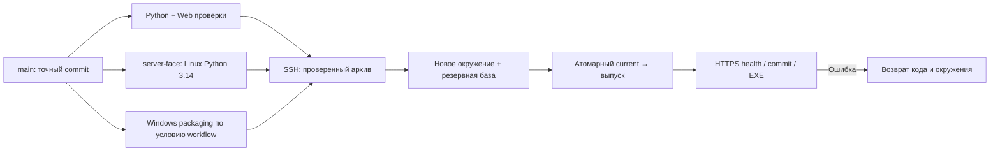

# Развёртывание Qorgau 0.5.2

Workflow [.github/workflows/release.yml](../.github/workflows/release.yml) проверяет Python/Ruff, веб-тесты и production-сборку; отдельное задание `server-face` проверяет настоящий YuNet/SFace CPU runtime на Ubuntu/Python 3.14 в урезанной серверной структуре. Windows-задание собирает и проверяет EXE при предусмотренных workflow условиях. Деплой допускается только после успешных обязательных проверок. Версию уже опубликованного сервера определяют `/api/health` и `/deployment.json`, а не этот документ.

Push в `main` проверяет и обновляет код/сайт; если Windows-job пропущен, сохраняется прежний скачиваемый EXE. Ручной запуск на `main` собирает Windows-пакеты и передаёт новый онлайн-EXE. Ветки/PR не получают production-деплой. GitHub Release создаётся отдельным publish-workflow из проверенных артефактов; автономный EXE скачивается через фиксированную ссылку на версию Release. Обновлять только веб-код недостаточно для смены модели или клиентского поведения.



## Что находится в выпуске

Приёмник принимает ограниченный набор: `backend`, `shared`, `deploy`, `web/dist`, `requirements-core.lock`, `pyproject.toml`, `dist/Qorgau-Student.exe`. Серверные teacher-модели, лицензии и manifest помещаются в `backend/proctor/assets/teacher-faces`; сервер не зависит от наличия корневого `models/`. Зависимости устанавливаются binary-wheel пакетами под серверную версию Python; отдельная CI-проверка исполняет детектор на пустом изображении и SFace на синтетическом crop. Это проверка runtime, не качества биометрии.

Деплой создаёт отдельный каталог кода/окружения и перед переключением запускает штатное резервирование. Новые резервные архивы содержат SQLite/метаданные **без видео**; старые принадлежащие Qorgau архивы санитизируются с проверкой структуры и целостности базы. Служба резервирования относится к установленному до переключения коду, поэтому первое обновление политики может требовать повторного деплоя того же актуального SHA. Завершение проверяется по `backup_policy_status`, а не предполагается по одному успешному restart.

После подготовки атомарно переключается `/opt/qorgau/current` и перезапускается только `qorgau.service`. Данные, TLS, настройки и чужие проекты не входят в архив кода. При нехватке диска развёртывание останавливается до переключения. Старые выпуски/окружения сохраняются для отката.

## Доступ и ограничения приёмника

- Secrets GitHub: `QORGAU_SSH_KEY`, `QORGAU_KNOWN_HOSTS`.
- SSH-пользователь `qorgau-deploy`, forced command `deploy <commit SHA> <archive SHA-256>`, без shell/forwarding/PTY.
- Root-owned приёмник `/usr/local/sbin/qorgau-deploy`; обёртка `/usr/local/libexec/qorgau-deploy-ssh`.
- Зависимости устанавливаются непривилегированно; загруженный прикладной код не исполняется от root.
- Сериализация GitHub concurrency + серверный `flock`; устаревший SHA, не совпадающий с актуальным `main`, пропускается.

Установка/изменение самого приёмника требует административного доступа: `sudo bash deploy/install-cicd.sh <public-key>`. Архив приложения не заменяет установленный root-owned приёмник. Приватные ключи, host credentials и регистрационные секреты не добавляются в Git.

## Приёмка публикации

```sh
curl --fail https://212.19.134.23/api/health
curl --fail https://212.19.134.23/deployment.json
sudo systemctl status qorgau --no-pager
sudo journalctl -u qorgau -n 60 --no-pager
```

Сопоставьте commit/version, целиком скачанные онлайн-/автономный EXE с `SHA256SUMS.txt`, ресурсы сайта и отчёты CI. Range-ответ начала файла сам по себе не проверяет полный SHA-256. Для политики копий нужны `policy=database_only_v1`, `status=complete`, `failed_archives=0` и положительное число сохранённых архивов. Нулевой счётчик миграции на повторном чистом запуске нормален.

## Откат

При проверочной ошибке возвращаются прежние код и Python-окружение. Живая БД автоматически не откатывается: несовместимая миграция требует отдельного плана восстановления. Перед ручным откатом завершите активные сеансы и выберите существующий проверенный каталог:

```sh
sudo ln -s /opt/qorgau/releases/<проверенный-выпуск> /opt/qorgau/rollback.next
sudo mv -Tf /opt/qorgau/rollback.next /opt/qorgau/current
sudo systemctl restart qorgau
curl --fail https://212.19.134.23/api/health
```

Действия выполняются администратором сервера; deploy-ключ для свободного shell не подходит. Подробные пути, сроки видео и резервирование — [SERVER.md](../docs/SERVER.md). Автоматическое развёртывание не подтверждает физическую камеру, точность моделей или защиту рабочего стола.
