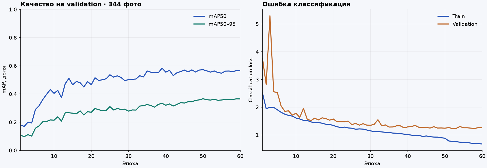

# Историческая карточка моделей 6 октября

Этот документ сохраняет экспериментальные метрики и runtime 0.4.5–0.4.6. В 0.5.2 рабочий детектор телефона и лиц сохранён, а основной контроль взгляда заменён CNN с обязательной личной калибровкой. Текущий состав и ограничения — [карточка 7 октября](MODEL_CARD_2026_10_07.md). Прежние показатели ExtraTrees и фразы об отсутствии калибровки не относятся к текущему взгляду.

---

# Модели Qorgau 2026.10.06.2

Назначение: локальный анализ телефона, присутствия лиц и направлений отвлечения в агенте Windows. Модели создают наблюдения для правил и разбора преподавателем. Они не устанавливают факт списывания и не измеряют точную точку взгляда на экране.

**Обновление документа: 7 октября 2026 года, приложение 0.4.6 / правила 3.1.** Веса и версия моделей **2026.10.06.2 не изменились**. Порог телефона, геометрическая проверка головы, таймеры и пауза распознавания изменены в коде исполнения; повторное обучение не проводилось. Метрики первоначального обучения ниже сохранены как исторические и не подменяют оценку нового поведения. Статус сборки и развёртывания: [0.4.6](RELEASE_0_4_6.md).

## Изменения исполнения в 0.4.6

Телефон учитывается при **confidence ≥ 0,80**, включая ровно 0,80. Один порог используется детектором, материалами события, проверкой старта и правилами. Для `PHONE_DETECTED` по-прежнему нужны два обнаружения за интервал до 0,6 с. Рамки ниже порога не показываются и не создают события.

На тех же 108 фотографиях второго участника, уже использованных при разработке, повторно проверен окончательный ONNX на CPU:

| Вариант | Найден телефон / положительных фото | Пропуски | Ложное обнаружение / отрицательных фото |
|---|---:|---:|---:|
| 0.4.5, исторический порог 0,65 | 67 / 78 | 11 | 2 / 30 |
| 0.4.6, порог 0,80 по запросу пользователя | **55 / 78** | **23** | **0 / 30** |

Это компромисс: количество ложных обнаружений на данной выборке снизилось, но увеличились пропуски. Ноль на 30 отрицательных фотографиях не доказывает отсутствие ложных срабатываний в эксплуатации. Порог задан запросом пользователя, а не подобран по этому test; повторное использование уже просмотренных фото не считается новым независимым тестом.

Для рамок с сопоставлением по IoU: TP 53, FP 2, FN 25. Эти числа отличаются от наличия хотя бы одного обнаружения на фотографии: ложная дополнительная рамка возможна и на положительном изображении. Проверка CPU PyTorch / CPU ONNX при 0,80 совпала на всех 108 фото: минимальный IoU 0,999997, максимальное расхождение confidence 5,37×10⁻⁷. [Отчёт 0.4.6](../training/reports/phone-threshold-046.json). Измеренный p95 74,31 мс относится только к инференсу детектора на Ryzen 7 3800X, без захвата, второго YOLO, MediaPipe, записи и сети.

Для взгляда добавлена проверка относительного поворота головы по матрице MediaPipe: yaw от 22° по модулю даёт направление в сторону, pitch вниз от 18° — DOWN. Она дополняет классификатор, обученный на двух людях; движения только глаз оценивает прежний ExtraTrees. Это геометрические пороги относительно исходной позы, а не измерение границ монитора и не обещание одинаковой точности для любого лица.

Правила 3.1 используют время захвата кадра. Устаревшие, повторные и полученные до возобновления распознавания кадры не продлевают эпизод. Краткий UNKNOWN до 0,35 с при одном лице сохраняет уже наблюдённое время, но время неопределённости не прибавляется. Более длинный UNKNOWN, потеря/несколько лиц или разрыв наблюдений более 0,75 с прерывают накопление. Пятисекундный порог и три отдельных эпизода в одном направлении сохранены.

При `LOCKED` распознавание YOLO/MediaPipe приостанавливается. Последний проанализированный кадр ограничивает измеренную длительность события; сырой захват и дозапись клипа продолжаются. После разрешения преподавателя рассматриваются новые кадры. Пауза не трактуется как отсутствие телефона или взгляд на экран, а исторические интервалы не заполняются выдуманными наблюдениями.

Повторный [gaze-replay 0.4.6](../training/reports/gaze-runtime-046.json) прошёл на **31 прежнем видео, 1 879 кадрах при 5 fps**. Получено **7 событий: 4 DOWN, 2 LEFT, 1 RIGHT**; на семи записях сценария on-screen событий нет. Число событий совпадает с 0.4.5, поэтому прирост точности по этому результату не заявляется. Это повторно использованные development-записи, а не независимый тест новых участников. На этих записях нет кадров с обнаруженным телефоном при 0,80; они не заменяют отдельную телефонную выборку.

Максимальный p95 обработки кадра среди 31 записи — **251,1 мс** на Ryzen 7 3800X. Замер включает совместный инференс моделей, но не живой захват, кодирование и сеть, и не гарантирует тот же темп на другом ПК. Физическая проверка камеры и новый независимый пилот остаются отдельными этапами.

## Стек и файлы

| Компонент | Роль | Что обучено командой |
|---|---|---|
| YOLO11n, `yolo11n.onnx` | Рамки смартфона, один класс `cell phone`, индекс 0 | Дообучение готовой COCO-модели на COCO 2017 и проверенных собственных фото |
| YOLOv8n, `face_yolov8n.onnx` | Дополнительный детектор лиц | Готовая модель Bingsu/adetailer; собственное обучение лиц не заявляется |
| MediaPipe Face Landmarker, `face_landmarker.task` | Face Mesh с радужками, поворотом головы и blendshapes | Готовая модель MediaPipe |
| ExtraTrees, `gaze-direction.json` | SCREEN / DOWN / LEFT / RIGHT / UP по 33 признакам MediaPipe | Обучен на предоставленных записях; автоматическая исходная поза, без ручного мастера |

YOLO исполняется в ONNX Runtime на CPU. Классификатор взгляда — проверяемое дерево в JSON, без pickle, Torch и scikit-learn в EXE. Исходники, версии, источники и SHA-256 всех файлов зафиксированы в [model-manifest.json](../model-manifest.json). Сборка скачивает именно эти файлы и не экспортирует старую COCO-модель заново.

Защита окружения остаётся на Python с прямыми вызовами Windows API через ctypes: временные клавиатурные/мышиные hooks, удержание окна и восстановление после завершения. В коде нет Electron, pyautogui или keyboard; это явное отличие используемой библиотеки от примеров стека в кейсе при сохранении Python и назначения защиты.

## Второе лицо

Все 204 фотографии `person_detection` просмотрены. Названия папок относятся к **дополнительному человеку**: в `person_absent` уже есть один студент (33 кадра), в `person_present` рядом появляется второй (171 кадр), иногда с лицом за границей изображения. Это не набор пустой аудитории.

YOLOv8n обнаружил два лица в **150 из 171** кадров второго сценария; MediaPipe — в **101 из 171**. Объединённый счётчик `max(YOLO, MediaPipe)` даёт 150 обнаружений, 21 пропуск по сценарию и 0 лишних вторых лиц на 33 одиночных кадрах. Пропуски не исключались из знаменателя, в том числе обрезанные головы. Проверка PyTorch/ONNX на 16 дополнительных фото прошла. [Сценарные результаты](../training/reports/second-face-v2.json), [проверка экспорта](../training/reports/face-runtime-v2.json).

Это коррелированные фотографии тех же двух людей, без обучения YOLO лиц на них; не независимый популяционный benchmark и не измерение времени события. Работа на полностью пустом кадре требует отдельной проверки.

## Телефон: данные и оценка 0.4.5 — исторические результаты

Исходные автоматические предложения рамок не приняты как готовая разметка. Просмотрены 292 собственных фотографии: 216 с видимым телефоном, 73 без телефона, 3 неоднозначных мелких объекта исключены. Пропущенные/ошибочные рамки исправлены при визуальном просмотре Codex; независимой второй проверки человеком не было. Оригинальная очередь разметки архива сохранена.

К ним добавлены официальные COCO 2017 рамки `cell phone` и отрицательные изображения с человеком, книгой, пультом или ноутбуком. Рамки `mobile_use` из открытого датасета поведения не используются как рамки телефона.

- Train: **5 418 изображений**; COCO train и часть съёмки первого участника.
- Validation: **344 изображения**; COCO val и отдельные диапазоны первого участника. Между соседними диапазонами собственных фото оставлены промежутки.
- Test: **108 изображений второго участника**, целиком исключённого из обучения и выбора checkpoint.
- Проверены точные SHA-256 дубликаты между split; соседние фотографии одной серии не распределяются случайно.

YOLO11n инициализирован официальными весами COCO, обучение на NVIDIA L40S: 640 px, AdamW, seed 20261006, до 60 эпох, early stopping 15 эпох без улучшения. Лучший checkpoint выбирается по validation. Контрольные данные второго участника используются после выбора модели. Приведённый в этом историческом разделе порог **0,65** взят из правил 3.0; в приложении 0.4.6 действует **0,80**, описанный выше.

Завершены все **60 эпох**. На test итоговый mAP50 — **94,91%**, mAP50–95 — **74,44%**. Это интегральные показатели детектора, а не доля правильно заблокированных событий. [Полный отчёт](../training/reports/phone-v2.json).

| Проверка при confidence ≥ 0,65 | Найден телефон на 78 положительных фото | Ложное обнаружение на 30 отрицательных |
|---|---:|---:|
| Исходный COCO, PyTorch GPU | 30 / 78 | 0 / 30 |
| Дообученный checkpoint, тот же PyTorch GPU | 66 / 78 | 1 / 30 |
| Итоговый ONNX CPU с обработкой кадра из EXE | **67 / 78** | **2 / 30** |

Первые две строки используют одинаковый путь инференса и показывают улучшение полноты с 38,46% до 84,62% при появлении ложного обнаружения. Третья проверяет именно поставляемую модель: квадратный letterbox 640 и NMS 0,45 отличаются от стандартного прямоугольного preprocessing Ultralytics. Поэтому результаты двух способов не смешиваются. При просмотре двух ложных обнаружений модель приняла зелёную тетрадь за телефон. Среди пропусков есть телефон у нижней границы кадра и над головой. Эти test-примеры не использованы для подстройки порога. В ONNX остаются **11 пропусков**; для рамок при IoU ≥ 0,5 — TP 65, FP 4, FN 13.

Экспорт проверен на всех 108 фото: CPU PyTorch и CPU ONNX дают одинаковое число рамок, минимальный IoU **0,999990**, максимальное расхождение confidence **1,43×10⁻⁶**. [Отчёт экспорта](../training/reports/phone-export-v2.json). Указанное там время относится к CPU сервера обучения, не к компьютеру студента. Фото сами по себе не доказывают качество временного события из двух обнаружений.

График относится к смешанной validation из 344 изображений, а не к 108 собственным test-фото. [Числа всех эпох](../training/reports/phone-learning-curve-v2.csv).

## Взгляд: данные и оценка обученного классификатора

В предоставленном архиве два участника. В обучение допущены 1 063 предварительно размеченных ключевых кадра из 110 видео. **1 053** дают пригодные признаки, **10** пропущены из-за отсутствия надёжного лица/глаз; пропуски не объявляются SCREEN. Контрольные и калибровочные ролики исключены из обучения.

Разделение по целым видео: 66 train, 22 validation, 22 development holdout. Порог 0,65 выбран по validation, затем модель обучена на train + validation; holdout не добавлен в обучение. Поскольку этот holdout уже наблюдался при разработке нескольких вариантов, он **не является новым независимым итоговым тестом**.

| Проверка | Результат |
|---|---:|
| Development holdout, 215 пригодных кадров: balanced accuracy бинарного on/off | 94,66% |
| Recall off-screen при пороге 0,65 | 94,23% |
| Precision off-screen | 85,96% |
| FPR по on-screen кадрам | 4,91% |
| Поочерёдное исключение целого участника с подбором порога только на другом: balanced accuracy | 91,93% / 77,33% |
| Recall off-screen в этих двух проверках | 92,37% / 54,67% |
| Совпадение вероятностей экспортированного JSON со scikit-learn | 1 053 кадра; максимальная ошибка 5,56×10⁻¹⁶ |

Это кадровые показатели бинарной задачи для обученного классификатора, не «точность блокировки» и не оценка нового геометрического дополнения 0.4.6. Полные матрицы направлений и параметры: [gaze-v2.json](../training/reports/gaze-v2.json). Предыдущий классификатор с четырьмя признаками показал слабые результаты и не используется в основном потоке.

При исключении участника пороги выбирались на записях другого участника (0,60 / 0,70); исключённые ответы не участвовали в выборе порога. Но признаки и архитектура разрабатывались с доступом к обоим участникам, поэтому и эта проверка остаётся аудитом разработки. Более слабая полнота на втором участнике показывает, что переносимость на нового человека ещё нельзя считать подтверждённой. Матрицы направлений включают отдельный UNKNOWN, а не маскируют его как SCREEN.

Просмотр кадров с ошибками показывает отдельные DOWN при моргании и RIGHT при взгляде к правой части экрана. Таймер ограничивает короткие срабатывания, но не гарантирует отсутствие ложного события при длительном чтении у края. Исходная разметка сохраняет ограничение о неподтверждённом зеркальном соглашении: LEFT/RIGHT соответствуют названиям сценариев съёмки, а не измеренным физическим углам.

## Прогон полных записей 0.4.5 — исторические результаты

Через MediaPipe VIDEO, YOLOv8n лиц, новый JSON-классификатор и реальные правила событий воспроизведены **31 запись, 370,37 секунды, 1 879 кадров при 5 fps**: 22 development holdout и 9 коротких control. Счётчик лиц использует ту же политику `max(YOLO, MediaPipe)`, что и агент. Результаты: [gaze-replay-v2.json](../training/reports/gaze-replay-v2.json).

Из 1 879 кадров 118 получили UNKNOWN, в 19 не было пригодного лица. На размеченных on-screen кадрах 1 018 SCREEN, 50 направленных away и 79 UNKNOWN; на off-screen — 329 away, 4 SCREEN и 17 UNKNOWN. Оставшиеся кадры относятся к неопределённым/переходным интервалам разметки.

Правила выделили **7 эпизодов длительного отвлечения**. На записях сценариев обычного взгляда длительностью суммарно 97,77 с пятисекундных событий не было. Это ограниченное наблюдение, **не оценка ложных событий за час**. Девять контрольных роликов короче четырёх секунд и не могут сами подтвердить отсутствие ложных пятисекундных событий. Границы gaze-сегментов предварительные; точный event precision/recall без дополнительной ручной проверки не заявляется.

Совместно все четыре итоговые модели проверены через реальный `Camera.analyze` на тех же 31 видео и 1 879 кадрах: 7 gaze-событий (4 DOWN, 2 LEFT, 1 RIGHT), 0 кадров с телефоном при пороге 0,65, 0 кадров с несколькими лицами. Это интеграционный прогон записей взгляда, а не отдельный тест наличия телефона или второго человека. [Полный результат](../training/reports/full-runtime-v2.json).

На локальном Ryzen 7 3800X максимальный p95 отдельной записи составил **287,1 мс** на полный анализ кадра, включая оба YOLO, MediaPipe и gaze. Во время прогона выполнялись и другие локальные проверки; замер не изолирует нагрузку. Захват камеры, кодирование и сеть не включены. Значение не гарантирует 5 fps на любом компьютере.

## Как используется автоматическая исходная поза

Ручная восьмиточечная калибровка убрана из обычного запуска. Первый пригодный кадр с открытыми глазами становится фиксированной исходной позой текущего включения камеры. Дальнейшие признаки выражаются относительно неё. Она не сдвигается вслед за отвлечением и не сохраняется как персональный профиль.

Все предоставленные записи начинались со взгляда на экран. Если студент уже смотрит в сторону при включении или переставляет камеру позже, исходная поза может быть неверной. При включении нужно смотреть на экран, а после перемещения камеры — включить её заново. Это автоматическая нормализация положения, а не обещание распознавания без какой-либо исходной информации.

Неуверенное направление/отсутствующее наблюдение возвращает UNKNOWN. В правилах 3.1 краткая неопределённость до 0,35 с при одном лице сохраняет уже накопленное время, но не добавляет новое; потеря лица и более длинные пробелы прерывают эпизод. Вниз, влево и вправо имеют отдельные счётчики, порог наблюдённого отвлечения 5 с. UP не добавлен к блокирующим направлениям. Второе лицо не должно использоваться для определения исходной позы.

## Ограничения и воспроизведение

Два участника, ограниченные ракурсы и предварительная разметка не покрывают разные камеры, очки, освещение и людей. Точная граница монитора не измеряется. Нужен следующий независимый прогон на новых людях и длинных записях обычной работы, включая чтение по краям экрана; параметры после такого прогона нельзя менять, сохраняя его статус test.

Физическая камера Windows и попытки обхода защиты проверяются отдельно от replay. Обновление сайта не меняет установленное приложение: для исправлений порога, взгляда и паузы нужен EXE/установщик 0.4.6. В 0.4.5 были те же веса 2026.10.06.2, но прежний код исполнения.

Команды подготовки/обучения: [training/README.md](../training/README.md). Исходные лица, фотографии, видео и извлечённые биометрические признаки не публикуются. В релиз входят веса, исходники и агрегированные отчёты. [Источники и лицензии](../THIRD_PARTY_NOTICES.md).
