# Обучение Qorgau: данные, результат и воспроизведение

В исходниках приложения 0.5.2 используется комплект `2026.10.07.gaze-demo`: новая continuous gaze CNN и ранее проверенные детекторы телефона/лиц. Это результат дообучения, а не обучение с нуля. Дополнительные YuNet/SFace для преподавателя — отдельные готовые модели. Версии, источники и SHA-256 задаются `model-manifest.json` и `teacher-face-manifest.json`.

## Эксперимент 7 октября 2026 года завершён

Общий разрешённый интервал составлял **08:47:54–18:47:54 UTC** 7 октября, то есть до **23:47:54 Asia/Qyzylorda**. Это исторический срок, он не начинает новый десятичасовой отсчёт при чтении инструкции. Обучение выполнялось на отдельной NVIDIA L40S; клиент использует CPU. Протокол ресурсов/срока — [ten-hour-budget](provenance/ten-hour-budget-2026-10-07.md), первоначальное состояние — [снимок запуска](reports/public-training-launch-2026-10-07.json). Описание запущенного этапа само не является свидетельством успешного завершения: итог определяется отчётами ниже.

| Задача | Итог | Что поставляется |
| --- | --- | --- |
| Направление взгляда | MobileNetV3 Small дообучена на MPIIFaceGaze и Gaze360, итоговый checkpoint проверен и экспортирован | `gaze-public.onnx` и метаданные `gaze-public.json` |
| Телефон/человек, новый COCO-кандидат | Итоговые критерии обнаружения не пройдены | Прежний дообученный детектор телефона сохранён |
| Лица, новый WIDER-кандидат | Итоговые критерии полноты не пройдены | Прежний YOLOv8n face сохранён |

Неудачный кандидат не заменяется удачным названием релиза. [COCO final](reports/coco-public-final-2026-10-07.json) и [WIDER final](reports/wider-public-final-2026-10-07.json) сохраняют фактический результат.

## Как подготовлены данные

Датасеты скачиваются и проверяются в `data/datasets/`; производные индексы, выбранные кадры и face crops хранятся отдельно. Исходные архивы, записи людей и обучающие данные не включаются в приложение или Git. [Инструменты загрузки/докачки](datasets/README.md) проверяют целостность; локальные `status.json` фиксируют приобретённый объём. Большой архив не пересылается при каждом запуске обучения: конвейер читает уже подготовленные файлы на тренировочной машине.

| Источник | Полный проверенный объём | Пригодные train / validation | Финальная оценка |
| --- | --- | --- | --- |
| MPIIFaceGaze | 37 667 уникальных полноразмерных изображений, 15 участников | 30 768 / 3 802; p00–p10 / p11–p12 | 2 997 из 2 998 кадров p13–p14 |
| Gaze360 | 197 588 кадров головы; 27 653 вне официальных split не используются как размеченное обучение | 94 563 / 12 318; исходные группы записей разделены | 17 847 из 25 969 кадров, 15 test-групп |
| WIDER FACE | 12 880 train / 3 226 validation / 16 097 test | Development выделен из train по категориям событий; изображения с невалидными лицами исключены целиком | Все 3 226 официальных validation-изображений; официальный test без открытой разметки не выдаётся за измеренную оценку |
| COCO 2017 | 118 287 train2017 / 5 000 val2017 | Около 5% train2017 выделено для development, отрицательные изображения сохранены | Все 5 000 val2017 |

Повторяющиеся MPII-аннотации глаз не превращаются в повторное обучение одного полноразмерного изображения. Кадры одного Gaze360 recording group не разделяются между train/validation/test. Причины пропуска лица, моргания, маленького crop и декодирования считаются отдельно: задняя сторона головы не считается успешно распознанным взглядом.

## Как обучается взгляд

```mermaid
flowchart LR
    A["Исходники и аннотации MPII / Gaze360"] --> B["Неизменяемые split и проверка пересечений"]
    B --> C["Face Mesh → crop лица 224×224"]
    C --> T["Train: MobileNetV3 Small"]
    C --> V["Validation: выбор checkpoint и масштаб неопределённости"]
    T --> V
    V --> L["Фиксация единственного checkpoint и SHA-256"]
    L --> E["Final test: углы и покрытие"]
    E --> O["ONNX: численный паритет и CPU задержка"]
    O --> M["Manifest → встроенные файлы EXE"]
```



ImageNet-веса инициализируют backbone MobileNetV3 Small. Все его параметры дообучаются на обоих источниках. Изображение лица проходит одинаковую RGB/ImageNet-нормализацию при обучении и в приложении. Выход — единичный 3D-вектор взгляда и концентрация распределения, цель — directional negative log-likelihood. Источники и группы балансируются; горизонтальное отражение меняет знак соответствующей компоненты цели.

Validation выбирает checkpoint по средней угловой ошибке двух источников и задаёт эмпирический масштаб неопределённости. Хеш выбранного checkpoint фиксируется **до** открытия final test. После просмотра итогового теста его нельзя использовать для выбора другой модели и продолжать называть независимым. Сохранённые протокол и отчёт: [gaze-public-v1](provenance/gaze-public-v1.md), [evaluation](reports/gaze-public-evaluation-2026-10-07.json).

| Источник | Средняя ошибка | Медиана | p90 | Покрытие всех test-кадров |
| --- | ---: | ---: | ---: | ---: |
| MPIIFaceGaze | 7,681° | 7,615° | 12,470° | 99,97% |
| Gaze360 | 13,217° | 10,636° | 24,981° | 68,72% |

Эти значения условны по пригодному видимому лицу. Два MPII test-участника ограничивают вывод о новых людях; Gaze360 single-frame visible-face результат не равен официальному временному all-directions benchmark. Это не точность решения «студент нарушил правила».

Экспорт CPU ONNX показал максимальное абсолютное расхождение с PyTorch `9,06×10⁻⁶`. Измеренная задержка только CNN: медиана 7,51 мс, p95 10,19 мс при четырёх потоках на указанном в отчёте стенде. Камера, YOLO, MediaPipe, запись и сеть не входят в эту задержку; она не задаёт FPS приложения. [Отчёт экспорта](reports/gaze-public-export-2026-10-07.json).

## Как модель превращается в экранное направление

Датасет не обучает метку SCREEN для произвольного монитора. В приложении 0.5.2 девять точек по три секунды строят личную угловую область: пять задают её, четыре другие проверяют согласованность. Первые 0,8 секунды точки исключены, нужны минимум три свежих пригодных наблюдения. Повторы сохраняют подходящие точки и не ослабляют пороги; зависимые контрольные измерения собираются заново. Вне области используется запас 6°, затем временные правила. Эта пользовательская калибровка не переобучает CNN и не является новым независимым датасетным тестом.

## Воспроизвести новый эксперимент

Используйте отдельное тренировочное окружение и новый каталог результата. Конкретные версии библиотек, источники, аргументы, split и хеши должны соответствовать сохранённым протоколам. Не копируйте завершившийся абсолютный срок 7 октября в новый запуск.

```powershell
python -m training.public_gaze_prepare index --data data/datasets --output data/public-gaze
python -m training.public_gaze_prepare extract --output data/public-gaze --model models/face_landmarker.task --workers 8 --disable-audio
python -m training.public_gaze_train --data data/public-gaze --output training/runs/new-public-gaze --device cuda:0 --batch 128 --workers 6 --epochs 40 --patience 8
```

Команды детекторов, условия split и обработки WIDER: [detection-public-protocol](provenance/detection-public-protocol.md). Ограниченные smoke-прогоны проверяют исполнение и не принимаются как релизная точность. Экспорт готового checkpoint после сбоя не должен повторно открывать test: предусмотрен `--export-only`.

Для установки приложения обучение не запускают: `scripts/prepare_models.py` и `scripts/prepare_teacher_faces.py` получают закреплённые артефакты, проверяют хеши; PyInstaller включает их в оба EXE. [Карточка текущих моделей](../docs/MODEL_CARD_2026_10_07.md) · [Условия компонентов](../THIRD_PARTY_NOTICES.md).

## История экспериментов до новой модели взгляда

**Все разделы ниже описывают прежние версии и сохраняются для воспроизводимости.** Фразы «без калибровки», «контроль взгляда выключен» и метрики ExtraTrees относятся к указанным старым версиям. Текущий 0.5.2 использует новую CNN и обязательную адаптивную настройку. Прежний phone-кандидат 6 октября остаётся рабочим, но это не превращает старую оценку взгляда в текущую.

## Runtime 0.4.6: прежние веса, исправленные правила

Модели версии `2026.10.06.2` не переобучались. Порог телефона поднят по требованию пользователя до **0,80 включительно**: [повторная проверка тех же 108 фото и паритета ONNX](reports/phone-threshold-046.json). Новый порог обнаруживает 55/78 положительных фото, ложных обнаружений на 30 отрицательных нет; прежние показатели ниже относятся к порогу 0,65 в 0.4.5.

Правила 3.1 допускают интервал наблюдений до 0,75 с и короткую неопределённость до 0,35 с без прибавления неизвестного времени. Явный поворот головы дополняет классификатор геометрией MediaPipe относительно фиксированной исходной позы. [Воспроизведение полного пайплайна 0.4.6](reports/gaze-runtime-046.json): 31 прежняя development-запись, 1 879 кадров, 7 событий взгляда. Это проверка исполнения на сохранённых данных, не новая независимая оценка точности. Применение LOCKED/UNLOCK и отбрасывание старых кадров проверяются отдельно в `tests/test_recognition_pause.py`.

## Рабочие модели 0.4.5: дообучение 6 октября 2026

Новый комплект — YOLO11n `cell phone`, отдельный готовый YOLOv8n face, MediaPipe Face Mesh и ExtraTrees на 33 признаках глаз/головы. В EXE нет пользовательской калибровки: фиксированная исходная поза берётся автоматически при включении камеры. [Карточка моделей и ограничения](../docs/MODEL_CARD_2026_10_06.md), [манифест весов](../model-manifest.json).

Телефон: визуально просмотрены 292 собственных фото, исправлены предложения рамок, 3 неоднозначных исключены. Это просмотр Codex, не независимая двойная человеческая разметка. Официальные COCO `cell phone` аннотации смешаны с проверенными фото. Разделение: 5 418 train / 344 val / 108 test; второй участник целиком оставлен для итогового сравнения с исходным YOLO11n COCO. Модель поведения с классом `mobile_use` не используется как разметка смартфона.

Взгляд: 1 053 пригодных ключевых кадра, 10 пропусков; целые видео разделены 66/22/22. Экспорт JSON совпадает со scikit-learn на всех пригодных кадрах с погрешностью округления. Development holdout: balanced accuracy 94,66%; исключение целого участника — 91,93% / 77,33%. Эти результаты не являются финальным независимым тестом после всех итераций разработки. Полные записи отдельно воспроизведены через временные правила.

Отчёты: [телефон](reports/phone-v2.json), [проверка ONNX](reports/phone-export-v2.json), [взгляд](reports/gaze-v2.json), [полные видео](reports/gaze-replay-v2.json), [все модели вместе](reports/full-runtime-v2.json), [проверка YOLO лиц](reports/face-runtime-v2.json), [второе лицо](reports/second-face-v2.json). Частные фотографии и признаки не публикуются.

Папки `person_detection/person_absent` и `person_present` описывают отсутствие/присутствие **второго** человека: после просмотра 204 фото подтверждено, что основной студент есть во всех кадрах. Их нельзя автоматически использовать как разметку пустой аудитории. YOLOv8n обнаружил два лица в 150/171 кадров второго сценария, MediaPipe — в 101/171; на 33 одиночных фото лишних вторых лиц нет. 21 пропуск сохраняется, включая кадры с обрезанной второй головой. Модель лиц на этих фото не обучалась.

### Воспроизведение

Телефон обучается в отдельном окружении Python 3.11, PyTorch 2.6.0+cu124, Ultralytics 8.3.221, ONNX 1.17.0. NVIDIA L40S используется только для обучения, клиент исполняет модели на CPU. Классификатор взгляда: Python 3.12, scikit-learn 1.7.2, MediaPipe 0.10.32. Другие модели на GPU-сервере не останавливались.

```powershell
# После безопасного импорта архива и визуальной проверки рамок.
# reviewed.json — частная проверенная разметка; она не входит в Git.
python -m training.prepare_phone_v2 --dataset data/qorgau_dataset --review training/runs/phone-review/reviewed.json --output data/phone-v2
python -m training.train_phone_v2 --data data/phone-v2/data.yaml --output training/runs/phone-v2-fast --epochs 60 --batch 64 --workers 12 --cache disk --device 0
python -m training.check_phone_export --manifest data/phone-v2/manifest.json --onnx training/runs/phone-v2-fast/phone-yolo11n.onnx --checkpoint training/runs/phone-v2-fast/fit/weights/best.pt --output training/runs/phone-v2-fast/export-check.json

python -m training.extract_gaze_v2 --dataset data/qorgau_dataset --face-model models/face_landmarker.task --output training/runs/gaze-v2-features-final
python -m training.train_gaze_v2 --help
# split.json создаётся один раз целыми видео; сохранённый split не меняется между итерациями.
python -m training.train_gaze_direction --features training/runs/gaze-v2-features-final/features.json --split training/provenance/gaze-v2-split.json --output training/runs/gaze-direction-final
python -m training.replay_gaze_v2 --dataset data/qorgau_dataset --face-model models/face_landmarker.task --yolo-face-model models/face_yolov8n.onnx --model training/runs/gaze-direction-final/gaze-direction.json --split training/provenance/gaze-v2-split.json --output training/runs/gaze-replay-release
python -m training.check_face_presence --dataset data/qorgau_dataset --models models --output training/runs/second-face-v2
```

При сборке приложения применяется `scripts/prepare_models.py`: он скачивает закреплённые итоговые файлы и проверяет SHA-256; обучение и повторный экспорт при упаковке не выполняются. Для повторного обучения нужны исходный частный архив, проверенные рамки и COCO. В текущем коде защиты Python напрямую вызывает WinAPI; названия pyautogui/keyboard в кейсе не следует выдавать за фактически используемые зависимости.

## Исторические эксперименты до 0.4.5

Разделы ниже сохраняют прежние результаты и решения о неприменении старых моделей. Утверждения о выключенном по умолчанию взгляде и готовом COCO относятся к тем версиям, а не к комплекту 2026.10.06.2.

Команда собрала собственные данные и выполнила отдельные эксперименты на собственной и открытой выборках. COCO YOLO11n и MediaPipe используются как готовые базовые модели, не выдаются за разработанные или обученные с нуля командой.

## Состав

| Данные | Количество | Статус |
|---|---:|---|
| Собственные фото | 496 | Сценарии с телефоном / без телефона и присутствие человека |
| Собственные видео | 132 | Взгляд, калибровка, контроль, присутствие |
| Участники gaze-съёмки | 2 | Недостаточно для оценки всей аудитории |
| Размеченные ключевые кадры взгляда | 1 392 | Предварительная визуальная разметка с подсказкой сценария |
| Ключевые кадры для экспериментального обучения | 1 063 | Из 110 видео, без control/calibration |
| Открытые изображения поведения | 5 575 | Zenodo 14606173 |
| Подготовленная открытая выборка | 5 493 | 3 888 train / 887 val / 718 test |
| Без разметки / карантин | 81 / 1 | Не превращаются в отрицательные примеры |

Суммарно 6 203 исходных медиафайла. [Исходная сводка](provenance/dataset-summary.json) описывает состояние **при упаковке**, поэтому её `ml_training_executed: false` сохраняется как исторический факт. Выполненные затем эксперименты подтверждаются отдельными отчётами в `reports/`.

## Проверка и импорт

```sh
python -m training.import_bundle /path/to/qorgau_training_bundle.zip
python training/bundle_tools/validate_package.py --hashes --bundle
```

Папка `data/qorgau_dataset/` не входит в Git. Импорт проверяет пути, симлинки, размер и CRC и не перезаписывает существующий набор. Проверка содержимого подтвердила SHA-256 исходных медиа и всех файлов ZIP-манифеста, а также отсутствие пересечений public recording groups и точных дубликатов между split: [отчёт](reports/package-validation.json). Повторное полное декодирование изображений в этой проверке не запускалось; соответствующее поле отчёта остаётся `false`.

## Окружение

Рекомендуется отдельная среда Python 3.12; команды ниже используют её интерпретатор.

```sh
python -m pip install torch torchvision --index-url https://download.pytorch.org/whl/cpu
python -m pip install -e '.[cv,training]'
python scripts/fetch_models.py
```

Источники и закреплённые SHA-256 исходных весов — [pretrained-models.json](provenance/pretrained-models.json). Обучение выполнялось на CPU. Seed — `20261006`. Полные версии ключевых библиотек записаны в отчёты.

## Эксперимент A: собственные данные взгляда

```sh
python -m training.train_gaze --dataset data/qorgau_dataset --face-model models/face_landmarker.task --output training/runs/gaze-runtime
```

На пригодных ключевых кадрах извлекаются те же четыре нормализованных признака радужки/головы, что в агенте (`shared/gaze.py`). Random Forest решает бинарную задачу `on_screen / off_screen`. Для каждой из двух оценок один участник полностью исключается из обучения; кадры соседних моментов не перемешиваются между train/test.

Результат: 1 000 пригодных кадров, 63 без надёжного признака (2 on_screen и **61 off_screen**). Balanced accuracy на невиданном участнике: **0,5063** и **0,4104**. Это слабая переносимость; простой общий классификатор нельзя использовать для автоматической блокировки. Метрики рассчитаны только по пригодным кадрам и не скрывают пропуски детектора. [Полный отчёт](reports/gaze.json).

Итоговая модель после оценки обучается на всех 1 000 пригодных кадрах и экспортируется в безопасный JSON-формат. Функция `shared.gaze.predict_offscreen` выполняет инференс без загрузки pickle. Эта модель включена в пакет экспериментов, **но не включена в автоматические решения агента**. Начиная с 0.4.2 телефон и лица работают без персональной калибровки, а контроль взгляда по умолчанию выключен. Восьмиточечная настройка взгляда остаётся отдельной возможностью; её точность ещё необходимо измерить на независимом пилоте.

## Эксперимент B: открытые данные поведения

```sh
python -m training.train_behavior --dataset data/qorgau_dataset --epochs 5 --fraction 1 --output training/runs/behavior-full
```

YOLO11n инициализируется весами COCO и дообучается на пяти исходных классах `eye_movement`, `hand_move`, `mobile_use`, `side_watching`, `mouth_open`. Размер 320 px, batch 8, пять эпох, 3 888 тренировочных изображений; лучший checkpoint выбирается по val, затем один раз оценивается на 718 test.

На полном train после пяти эпох: **test mAP50 = 0,4497; mAP50–95 = 0,2234; precision = 0,3528; recall = 0,5461**. Это качество вспомогательной задачи поведения, не точность телефона или списывания. [Отчёт полного прогона](reports/behavior-full.json); в релизе — соответствующий `best.pt`.

Перед этим проведён короткий прогон трёх эпох на 10% train: test mAP50 = 0,0464; это проверка работоспособности контура, не качество готового продукта. [Отчёт короткого прогона](reports/behavior-smoke.json).

Детектор поведения является отдельным исследовательским артефактом. Его рамки `mobile_use` нельзя подавать в агента вместо COCO `cell phone`: семантика отличается. В производственном потоке прототипа остаётся готовый COCO-детектор телефона.

## Дальнейшее дообучение phone/face на двух источниках

`annotations/phone_face_review.json` содержит очередь проверки рамок. Подготовленные предложения — не истинная разметка. Сначала проверить каждый используемый объект/отрицательный кадр, затем:

```sh
python training/bundle_tools/make_object_proposals.py --help
python training/bundle_tools/prepare_phone_face.py --help
```

Вспомогательные скрипты перенесены из пользовательского тренировочного пакета; изменены расположение корня и форматирование. Их исходные материалы остаются в архиве. `prepare_phone_face.py` не принимает непроверенные изображения как negatives. Перед реальным обучением обеспечить независимые группы людей/съёмок и проверить лицензии/согласия. Подготовка общей phone/face модели ещё не завершена; наличие архива не равнозначно готовой объектной разметке.

## Правила отчётности

- Не выдавать scripted demo за результаты камеры.
- Не называть gaze-классификатор измерителем точного направления или доказательством нарушения.
- Не заявлять, что open behavior boxes являются phone boxes.
- Не скрывать кадры без лица, пропуски, карантин и плохие результаты.
- Не добавлять исходные медиа, biometric features, `data/` или `runs/` в Git/релиз.
- В релиз передавать агрегированные отчёты и веса с хешами. Расширение до 20–30 добровольцев и независимая проверка — следующий этап пилота.


В 0.4.0 рабочий агент использует проверенный COCO YOLO11n в ONNX; обучение остаётся отдельным экспериментом. План текущего пользователя — P01/S01–S03: см. `docs/CV_EVALUATION.md`, `scripts/train_phone.py` и Word-план в `deliverables`.
